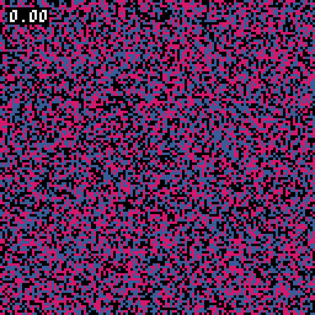

# Modèle de ségrégation de Schelling

<center>
{ width="50%" }
</center>

## Introduction

Dans les années 1970, Thomas C. Schelling a proposé un modèle pour montrer qu'une forte ségrégation spatiale peut être le résultat collectif de préférences individuelles qui ne visent pas, elles, à une telle ségrégation.

## Description du modèle

Prenez un échiquier et répartissez dessus aléatoirement des pions noirs et des pions blancs. Vous avez là une représentation très rudimentaire d'une aire urbaine où se côtoient deux populations. Ce pourrait être des catholiques et des protestants, des riches et des pauvres ou tout autre clivage.

Schelling ajoute ensuite une règle de déplacement des pions. Bien que tolérant, un individu déménage si moins d'un tiers de ses voisins immédiats partagent sa couleur. Dans le cas contraire, il est satisfait et reste sur place. Ce processus est répété jusqu'à ce que la situation se stabilise, lorsque tous les pions sont satisfaits de leur voisinage.

<!-- On ne peut pas dire que les individus recherchent la ségrégation dans cette situation. Une ségrégation véritablement souhaitée par les individus serait le cas où chaque individu souhaite qu'au moins la moitié de son voisinage partage sa couleur. En deçà de ce seuil, certaines minorités peuvent s'accepter et le mélange des deux communautés reste possible. -->

## Détails de l'implémentation

Par la suite, on parle d'**agents** pour désigner ces pions, et **grille** pour désigner l'échiquier.

* On dispose des agents bleus et rouges sur une grille de taille $n \times n$.

* Cette grille sera initialement rempli aléatoirement par autant d'agents bleus, d'agents rouges et de cellules vides.

* La grille sera représentée par un tableau à deux dimensions d'entiers. La valeur :
    *  `0` représente une cellule vide
    *  `1` représente un agent bleu
    *  `2` représente un agent rouge

    <center>
    { width="50%"}
    </center>

* On considérera le voisinage d'une cellule comme ses huit cellules adjacentes, appelé voisinage de Moore.
  
    <center>
    { width="25%"}
    </center>

* Les bords opposés de la grille sont connectés. Ainsi même les cellules au bord de la grille auront huit voisins :

    <center>
    { width="50%"}
    </center>

    Une telle grille est une surface toroïdale, cela signifie que la grille forme une structure topologique similaire à celle d'un tore en mathématiques. 

* Le **taux de satisfaction d'une cellule** $\in \big[0, 1\big]$ correspond au rapport :
    
    $$
        \frac{\text{Nombre d'agents voisins de même couleur}}{\text{Nombre d'agents voisins}}
    $$

    Il est important de noter que ce calcul exclu les cellules vides voisines à la cellule.

* Le **seuil de satisfaction** $\in \big[0, 1\big]$ correspond au taux de satisfaction à partir duquel un agent est satisfait de son entourage. Dans la description précédente du modèle de Schelling, ce seuil était fixé à $\frac{1}{3}$.

* Les agents insatisfaits seront retirés de la grille **puis** déplacés aléatoirement sur des cellules vides de la grille.

* Lorsque tous les agents sont satisfaits de leur voisinage, on parle de **situation stabilisée**.

## Démarche

### Simulation du modèle en Python

??? tip "Bonne pratique - Nommer les valeurs arbitraires"
    Une pratique recommandée en programmation pour éviter la manipulation directe de valeurs arbitraires consiste à les dissimuler sous des noms de variables. Dans notre cas, au début du programme, il est possible de définir les trois constantes représentant les différents états possibles d'une cellule de la grille de la manière suivante :
    
    ```py
    VIDE  = 0
    BLEU  = 1
    ROUGE = 2
    ```

    Cette approche permet d'écrire les conditions suivantes de manière plus explicite :

    <div style="display:flex; justify-content: center; align-items: center; gap: 10px;">
      
    ``` {.py3  .no-copy } 
    cellule != 0
    cellule == 1
    ```
    devient
    ```{.py3  .no-copy } 
    cellule != VIDE
    cellule == BLEU
    ```
    </div>

    En attribuant des noms significatifs aux constantes, le code devient plus clair et la logique sous-jacente est plus facilement compréhensible.

* Écrire une fonction `afficher_grille` qui prend en paramètre une grille et l'affiche joliment dans la console.

    <div style="display:flex; justify-content: center; align-items: center; gap: 10px;">
    
    ``` {.py3} 
    grille = [[2, 0, 2, 0, 2, 2],
              [2, 2, 2, 0, 0, 2],
              [2, 2, 0, 1, 1, 0],
              [2, 2, 0, 1, 1, 0],
              [0, 0, 1, 1, 1, 1],
              [0, 2, 0, 1, 0, 0]]

    afficher_grille(grille)
    ```

    ```{.pycon .no-copy title="Sortie"} 
    R · R · R R
    R R R · · R
    R R · B B ·
    R R · B B ·
    · · B B B B
    · R · B · ·
    ```

    ```{.pycon .no-copy title="Alternative"} 
    🐱🌲🐱🌲🐱🐱
    🐱🐱🐱🌲🌲🐱
    🐱🐱🌲🐦🐦🌲
    🐱🐱🌲🐦🐦🌲
    🌲🌲🐦🐦🐦🐦
    🌲🐱🌲🐦🌲🌲
    ```
    </div>


* Écrire une fonction `grille_aléatoire` qui prend en paramètre un entier $n$ et génère une grille de taille $n \times n$ remplie aléatoirement de cellules vides, d'agents rouges et bleues.

    ```py
    from random import randint

    def grille_aléatoire(n: int) -> list[list[int]]:
    ```

    <div style="display:flex; justify-content: center; align-items: center; gap: 10px;">
    
    ``` {.py3} 
    grille = grille_aléatoire(6)
    afficher_grille(grille)
    ```

    ```{.pycon .no-copy title="Sortie"} 
    🌲🐱🐱🐦🌲🐱
    🌲🐱🌲🌲🐱🐱
    🐱🐦🐦🐦🌲🐱
    🐱🐦🐦🐦🐱🐦
    🌲🌲🐱🌲🌲🌲
    🌲🌲🐦🐦🐦🐱
    ```
    </div>

* Écrire une fonction `cellules_adjacentes` qui prend en paramètres une grille et les coordonnées $(x, y)$ d'une cellule et renvoie, dans une liste, les cellules adjacentes à cette cellule.

    ```py
    def cellules_adjacentes(grille, x: int, y: int) -> list[int]:
    ```

    <div style="display:flex; justify-content: center; align-items: center; gap: 10px;">
    
    ``` {.py3} 
    grille = [[1, 2, 1, 2, 2, 2],
              [0, 1, 2, 0, 0, 0],
              [1, 1, 2, 0, 1, 2],
              [1, 1, 2, 1, 1, 1],
              [2, 0, 0, 1, 1, 2],
              [1, 1, 0, 0, 2, 0]]

    print(cellules_adjacentes(grille, 1, 1))
    print(cellules_adjacentes(grille, 5, 5))
    ```

    ```{.pycon .no-copy title="Sortie"} 
    [1, 2, 1, 0, 2, 1, 1, 2]
    [1, 2, 2, 2, 1, 2, 2, 1]
    ```
    </div>

* Écrire une fonction `compter_voisins` qui prend en paramètres une grille et les coordonnées $(x, y)$ d'une cellule et renvoie le nombre de cellules vides, rouges et bleues adjacentes à cette cellule.

    ```py
    def compter_voisins(grille, x: int, y: int) -> list[int]:
    ```

    <div style="display:flex; justify-content: center; align-items: center; gap: 10px;">
    
    ``` {.py3} 
    grille = [[1, 2, 1, 2, 2, 2],
              [0, 1, 2, 0, 0, 0],
              [1, 1, 2, 0, 1, 2],
              [1, 1, 2, 1, 1, 1],
              [2, 0, 0, 1, 1, 2],
              [1, 1, 0, 0, 2, 0]]

    print(compter_voisins(grille, 1, 1))
    print(compter_voisins(grille, 5, 5))
    ```

    ```{.pycon .no-copy title="Sortie"} 
    [1, 4, 3]
    [0, 3, 5]
    ```
    </div>

* Écrire une fonction `cellules_vides` qui prend en paramètre une grille et renvoie sous la forme d'une liste de tuples, les indices de toutes les cellules vides de la grille.

    ```py
    def cellules_vides(grille) -> list[tuple[int, int]]:
    ```

    <div style="display:flex; justify-content: center; align-items: center; gap: 10px;">
    
    ``` {.py3} 
    grille = [[1, 2, 1, 2, 2, 2],
              [0, 1, 2, 0, 0, 0],
              [1, 1, 2, 0, 1, 2],
              [1, 1, 2, 1, 1, 1],
              [2, 0, 0, 1, 1, 2],
              [1, 1, 0, 0, 2, 0]]

    print(cellules_vides(grille))
    ```

    ```{.pycon .no-copy title="Sortie"} 
    [(1, 0), (1, 3), (1, 4), (1, 5), (2, 3),
     (4, 1), (4, 2), (5, 2), (5, 3), (5, 5)] 
    ```
    </div>

* Écrire une fonction `remplir` qui prend en paramètres une grille, une liste d'indices, et une valeur, et assigne la valeur spécifiée à toutes les cellules correspondantes aux indices fournis.

    ```py
    def remplir(grille, indices: list[tuple[int, int]], valeur: int) -> None:
    ```

    <div style="display:flex; justify-content: center; align-items: center; gap: 10px;">
    
    ``` {.py3} 
    grille = [[1, 2, 1, 2, 2, 2],
              [0, 1, 2, 0, 0, 0],
              [1, 1, 2, 0, 1, 2],
              [1, 1, 2, 1, 1, 1],
              [2, 0, 0, 1, 1, 2],
              [1, 1, 0, 0, 2, 0]]

    afficher_grille(grille)
    remplir(grille, [(0, 0), (1, 1), (2, 2)], VIDE)
    afficher_grille(grille)
    ```

    ```{.pycon .no-copy title="Sortie"} 
    🐦🐱🐦🐱🐱🐱
    🌲🐦🐱🌲🌲🌲
    🐦🐦🐱🌲🐦🐱
    🐦🐦🐱🐦🐦🐦
    🐱🌲🌲🐦🐦🐱
    🐦🐦🌲🌲🐱🌲
    
    🌲🐱🐦🐱🐱🐱
    🌲🌲🐱🌲🌲🌲
    🐦🐦🌲🌲🐦🐱
    🐦🐦🐱🐦🐦🐦
    🐱🌲🌲🐦🐦🐱
    🐦🐦🌲🌲🐱🌲
    ```
    </div>


* Écrire une fonction `répartir_aléatoirement` qui prend en paramètres une grille et deux entiers $n_{b}$ et $n_{r}$ et répartie aléatoirement $n_b$ agents bleus et $n_r$ agents rouges sur les cellules vides de la grille.

    ```py
    from random import shuffle

    def répartir_aléatoirement(grille, nb_bleu: int, nb_rouge: int) -> None:
    ```

    ??? tip "Indications"
        Cette fonction s'écrit facilement en utilisant les fonctions `cellules_vides` et `remplir` précédemment codées. `random.shuffle` permettra de mélanger la liste des indices des cellules vides. 

* Écrire une fonction `actualiser` qui prend en paramètres une grille et un seuil de satisfaction et procède à une itération du modèle de Schelling.

    ```py
    def actualiser(grille, seuil_satisfaction: float) -> None:
    ```

* Finalement, écrire la fonction `simuler_console` qui prend en paramètre un entier $n$ et un seuil de satisfaction et simule le modèle de Schelling à partir d'une grille de taille $n \times n$ aléatoire.

    ```py
    def simuler_console(n: int, seuil_satisfaction: float) -> None:
    ```


### Affichage de la grille avec Pyxel

## Analyse du modèle

1. Pourquoi à partir d'un certain seuil de satisfaction, la situation ne se stabilise plus ?

2. Pourquoi peut-on dire qu'en dessous d'un seuil de satisfaction de 50%, les individus ne souhaitent pas véritablement une ségrégation ?

3. En illustrant votre réponse, justifier qu'une ségrégation spatiale a pourtant lieu en dessous de ce seuil de satisfaction de 50%.

4. La conclusion de Schelling « Une forte ségrégation spatiale peut être le résultat collectif de préférences individuelles qui ne visent pas, elles, à une telle ségrégation. » est-elle justifiée ?

## Aller plus loin

* Grâce à la bibliothèque Matplotlib, tracer le nombre d'itérations nécessaires pour stabiliser la situation en fonction du seuil de satisfaction.

* Ajouter une troisième couleur d'agents, ou plus.

* Considérer d'autres types de voisinage.


## Références

* [Schelling's model of segregation
](https://en.wikipedia.org/wiki/Schelling%27s_model_of_segregation)

* [Retour critique sur le modèle de ségrégation urbaine de Schelling
]([oui](https://ojs.uclouvain.be/index.php/emulations/article/view/forse_parodi_schelling/54763))

