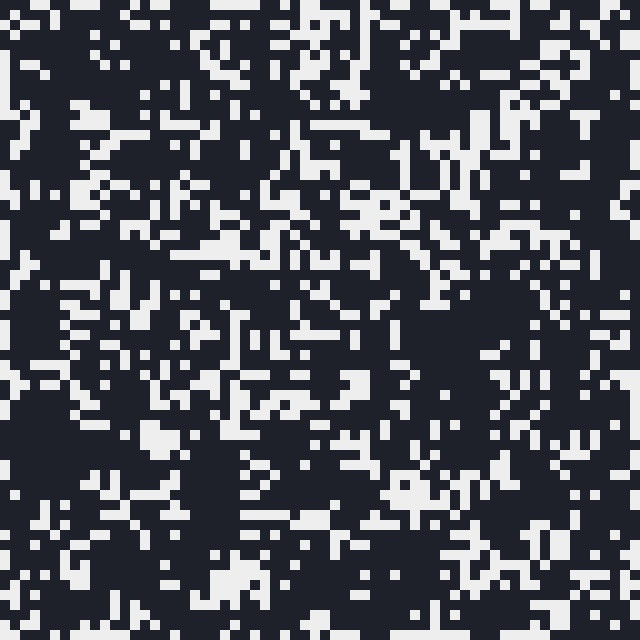
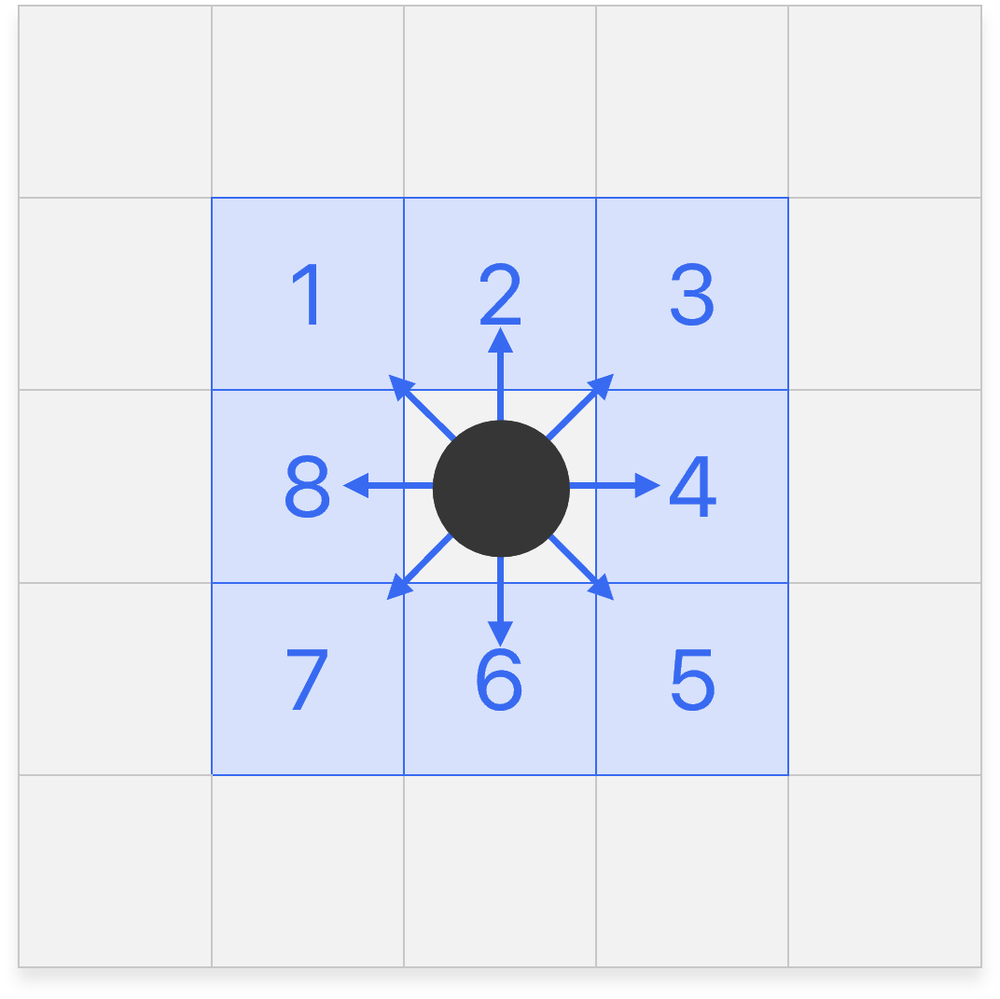
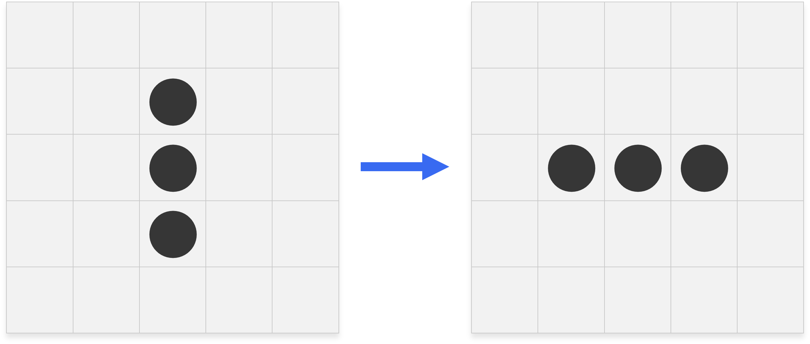
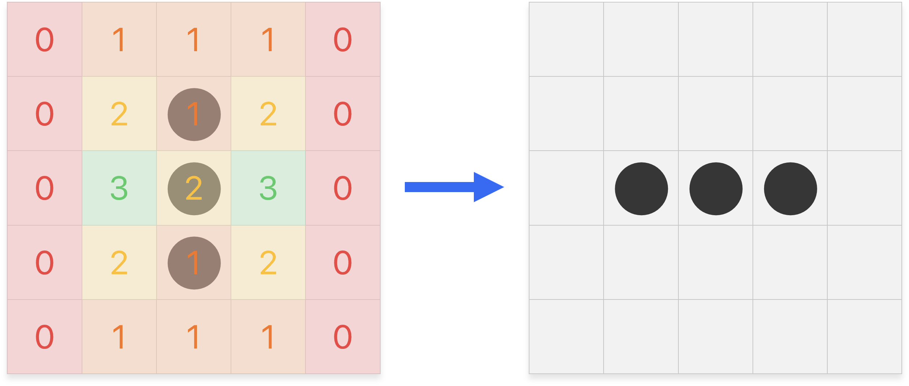

# Tableaux à deux dimensions

## Rappels

<figure markdown>
{ width=400px }
{ width=400px }
</figure>

Ainsi si on écrit `tab[i][j]`, on sélectionne l'élément à la ligne `i` et à la colonne `j`.

Soit `matrice` un tableau à deux dimensions, on peut parcourir ses éléments de deux manières :

* Parcours par éléments :
  
    ```py
    for ligne in tab:
      for élément in ligne:
          print(élément)
    ```

* Parcours par indices :

    ```py
    for i in range(len(matrice)):
        for j in range(len(matrice[i])):
            print(tab[i][j])
    ```

    Si `#!py len(matrice)` correspond aux nombres de lignes, `#!py len(matrice[i])` correspond aux nombres d'éléments de la ligne `#!py matrice[i]`.

## Projet : Un jeu de la vie

Le Jeu de la Vie n'est pas vraiment un jeu. Il s'agit d'un automate cellulaire fascinant qui simule l'évolution d'un groupe de cellules sur une grille. Chaque cellule peut être soit vivante, soit morte et son état évolue en fonction de règles simples. L'objectif est de programmer cet automate cellulaire et d'afficher son évolution :

<figure markdown>
{ width=400px }
</figure>

Dans cette animation, que vous allez recréer, une cellule vivante est blanche, et une cellule morte noire. Pour passer d'une itération à la suivante, on suit les règles suivantes.

### Règles

Une cellule possède huit cellules adjacentes voisines :

<figure markdown>
{ width=400 }
</figure>

À chaque itération, l'état d’une cellule est entièrement déterminée par l’état de ses huit cellules voisines, selon les règles suivantes :

* Une cellule morte devient vivante si elle possède exactement 3 cellules voisines vivantes.
* Une cellule vivante reste vivante si elle possède 2 ou 3 cellules voisines vivantes, sinon elle meurt.

Par exemple la configuration suivante devient :

<figure markdown>
{ width=800 }
</figure>

La transition entre les deux configurations est plus compréhensible en faisant apparaître le nombre de cellules vivantes voisines pour chaque cellule :

<figure markdown>
{ width=800 }
</figure>

### Démarche

* Une cellule est soit vivante, soit morte. Quel type est adapté pour représenter l'état d'une cellule ?

* Comment représenter la grille des cellules en Python ?

Pour la suite, on suppose que la grille des cellules du Jeu de la Vie est **carrée**. Dans un script Python `jeudelavie.py` ouvert dans Thonny, ajouter au fur et à mesure les fonctions suivantes :

* Pour vous aider à déboguer par la suite, écrire la fonction `afficher_matrice` qui prend en paramètre un tableau à deux dimensions et affiche correctement son contenu :

    ```py
    def afficher_matrice(matrice):
        """ Affiche la matrice donnée en paramètre. """
        # code à compléter
    ```

    ```pycon
    >>> afficher_matrice([[3, 5, 2], [7, 1, 4], [8, 6, 9]])
    3 5 2
    7 1 4
    8 6 9
    ```

    ??? tip "Mais print renvoie à la ligne automatiquement !"
        Soit vous construisez une grande chaîne de caractères avant de l'afficher (`#!py '\n'` correspond à un saut de ligne), soit vous pouvez afficher itérativement les éléments avec `#!py print(élément, end=' ')`, le paramètre caché `end` vaut par défaut `#!py '\n'`.

* Écrire la fonction `afficher_cellules` qui prend en paramètre une grille carrée de cellules et l'affiche « joliment » : par exemple, une cellule vivante sera représentée par le caractère `#!py '■'`, et une cellule morte par le caractère `#!py '·'`.

    ```py
    def afficher_cellules(grille):
        """ Affiche la grille de cellules donnée en paramètre. """
        # code à compléter
    ```

    ```pycon
    >>> afficher_cellules([[0, 1, 0], [0, 1, 0], [1, 0, 0]])
    · ■ ·
    · ■ ·
    ■ · ·
    ```

* Écrire la fonction `calculer_voisins` qui prend en paramètre une carrée de cellules et renvoie la matrice des voisins.

    ```py
    def calculer_voisins(grille):
        """ Calcule la matrice des voisins de la grille de cellules donnée en paramètre. """
        
        n = len(grille)  # on suppose la grille carrée
        voisins = [[0] * n for _ in range(n)]
        
        # code à compléter
        
        return voisins
    ```
    
    Par exemple, en reprenant l'exemple précédent :

    <div style="display:flex; justify-content: center; align-items: center; gap: 10px;">
    ``` {.py3} 
    cellules = [[0, 0, 0, 0, 0],
                [0, 0, 1, 0, 0],
                [0, 0, 1, 0, 0],
                [0, 0, 1, 0, 0],
                [0, 0, 0, 0, 0]]

    voisins = calculer_voisins(cellules)
    afficher_matrice(voisins)
    ```

    ```{.pycon .no-copy title="Sortie"} 
    0 1 1 1 0
    0 2 1 2 0
    0 3 2 3 0
    0 2 1 2 0
    0 1 1 1 0
    ```
    </div>

    Les cellules sur les bords risquent de poser quelques problèmes. Une solution est considérer des bords finis :

    <div style="display:flex; justify-content: center; align-items: center; gap: 10px;">
    ``` {.py3} 
    cellules = [[1, 0, 0, 0, 0],
                [0, 0, 0, 0, 0],
                [0, 0, 0, 0, 1],
                [0, 0, 0, 0, 0],
                [0, 1, 0, 0, 0]]

    voisins = calculer_voisins(cellules)
    afficher_matrice(voisins)
    ```

    ```{.pycon .no-copy title="Sortie"} 
    0 1 0 0 0
    1 1 0 1 1
    0 0 0 1 0
    1 1 1 1 1
    1 0 1 0 0
    ```
    </div>

    Une autre solution à la « Pac-Man » serait de considérer une grille dont les bords opposés sont adjacents.

* Écrire une fonction `grille_suivante` qui prend en paramètre une grille de cellules et renvoie la prochaine grille suivant les règles du Jeu de la Vie.

    ```py
    def grille_suivante(grille):
        """ Renvoie la prochaine grille de cellules après une itération. """

        voisins = calculer_voisins(grille)
        n = len(grille)
        grille_suivante = [[0] * n for _ in range(n)]
        
        # code à compléter
    
        return grille_suivante
    ```

    <div style="display:flex; justify-content: center; align-items: center; gap: 10px;">
    ``` {.py3} 
    cellules = [[0, 0, 0, 0, 0],
                [0, 0, 1, 0, 0],
                [0, 0, 1, 0, 0],
                [0, 0, 1, 0, 0],
                [0, 0, 0, 0, 0]]

    cellules = grille_suivante(cellules)
    afficher_cellules(cellules)
    ```

    ```{.pycon .no-copy title="Sortie"} 
    · · · · ·
    · · · · ·
    · ■ ■ ■ ·
    · · · · ·
    · · · · ·
    ```
    </div>

* Écrire la fonction `grille_aléatoire` qui prend en entrée un entier $n$ et renvoie une grille de taille $n \times n$ dont les cellules sont initialisées de manière aléatoire, c'est-à-dire que chaque cellule a une probabilité égale d'être vivante ou morte. Ne pas oublier la fonction `randint` de la bibliothèque `random` !

    ```py
    import random

    def grille_aléatoire(n):
        """ Génère une grille du Jeu de la Vie aléatoire de taille n × n. """
        # code à compléter
    
    ```

* Finalement, écrire la fonction `simuler` qui prend en entrée une grille de cellules initiale et simule le Jeu de la Vie.

    ```py
    def simuler(grille):
        """ Simule le Jeu de la Vie à partir de la grille de cellules donnée en paramètre. """
        continuer = True
        while continuer:

            # code à compléter

            saisie = input('Continuer ? ')
            if saisie = 'stop':
                continuer = False
    ```

### À bas la console !

Actuellement, notre simulation est visuellement rudimentaire. Soyons honnêtes, elle est même plutôt laide. Afin d'améliorer l'aspect de cette simulation, on se propose alors d'afficher la simulation du Jeu de la Vie au sein d'une fenêtre graphique. Pour ce faire, on utilisera la bibliothèque `pyxel`.

??? tip "Installer la bibliothèque pyxel dans Thonny"
    Dans Thonny, dans la barre d'outils, `Outils` :fontawesome-solid-caret-right: `Gérer les paquets`. Dans la barre de recherche, saisir `Pyxel` et cliquer sur `Rechercher sur PyPI`. Dans la liste des résultats, cliquer sur `pyxel`, puis `Installer`.

Une fois l'installation faites, assurez-vous que tout fonctionne en exécutant le code suivant :

```py
import time
import pyxel
import random

n = 50
pyxel.init(n, n)  # définit une fenêtre de n × n pixels

while True:
    pyxel.cls(0)  # efface l'écran et remplit le fond avec la couleur 0 (noir)
    x = random.randint(0, n)
    y = random.randint(0, n)
    pyxel.pset(x, y, 7)  # change la couleur du pixel (x, y) à 7 (blanc)
    pyxel.flip()  # rafraîchit la fenêtre
    time.sleep(0.5)  # on patiente 0.5 secondes
```

* Comment changer la couleur du fond de la fenêtre et du pixel ? [La documention de Pyxel à consulter.](https://github.com/kitao/pyxel/blob/main/docs/README.fr.md)

* Écrire la fonction `simuler_pyxel` qui simulera le Jeu de la Vie à partir d'une grille donnée en paramètre et la fonction `dessiner_cellules` qui dessinera la grille des cellules (elle remplacera `afficher_cellules`). Adapter le code précédent, tout s'y trouve ! 😊

### J'en veux plus !

* Une [excellente vidéo de ScienceEtonnante](https://www.youtube.com/watch?v=S-W0NX97DB0) sur le sujet qui vous permettra d'approfondir le sujet et découvrir d'autres automates cellulaires à programmer à l'envie.

* Le [Jeu de la Vie dans le Jeu de la Vie](https://www.youtube.com/watch?v=4lO0iZDzzXk) 🙀