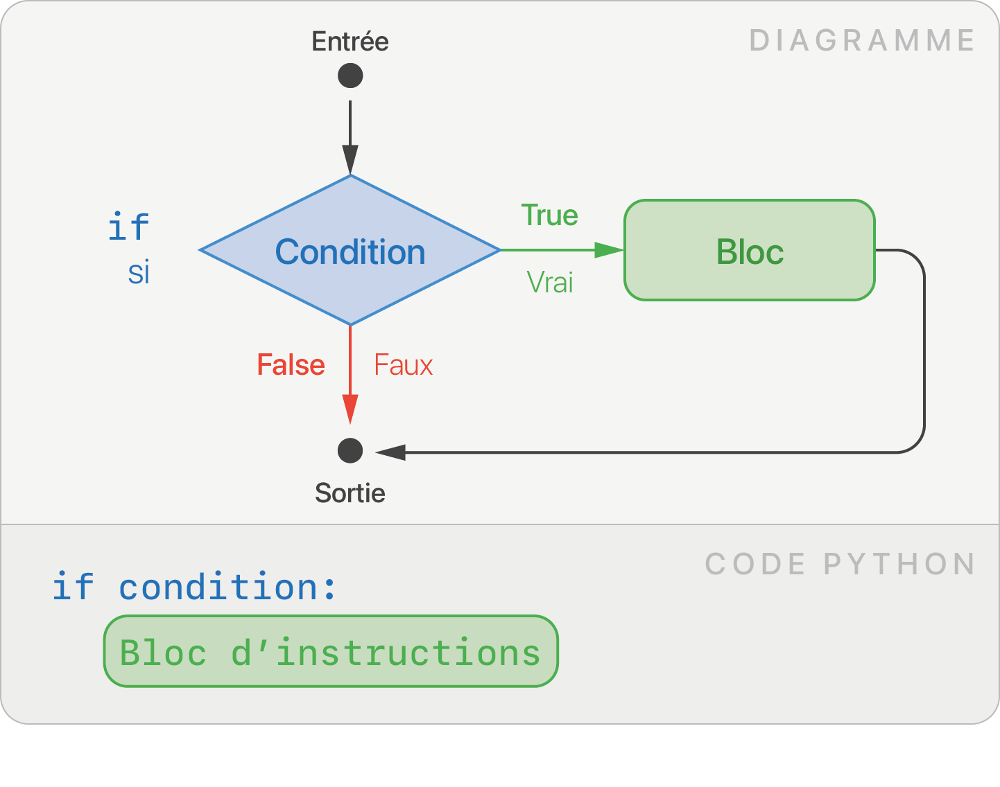
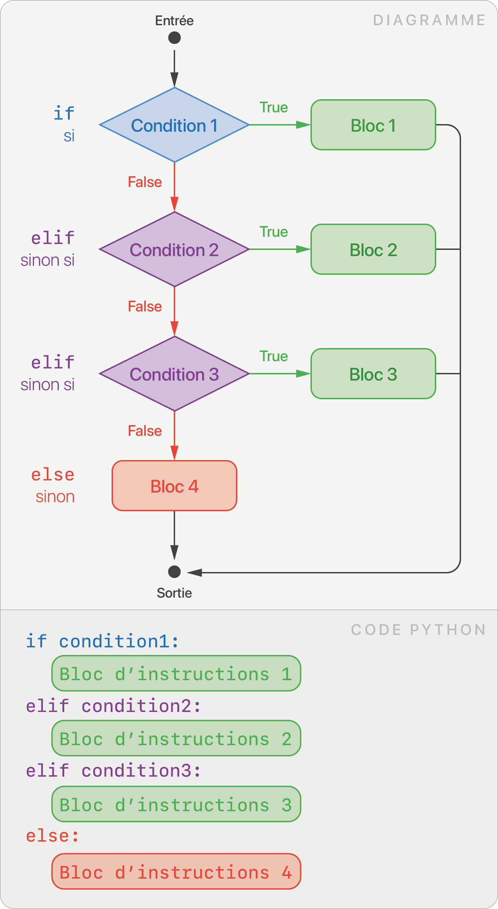
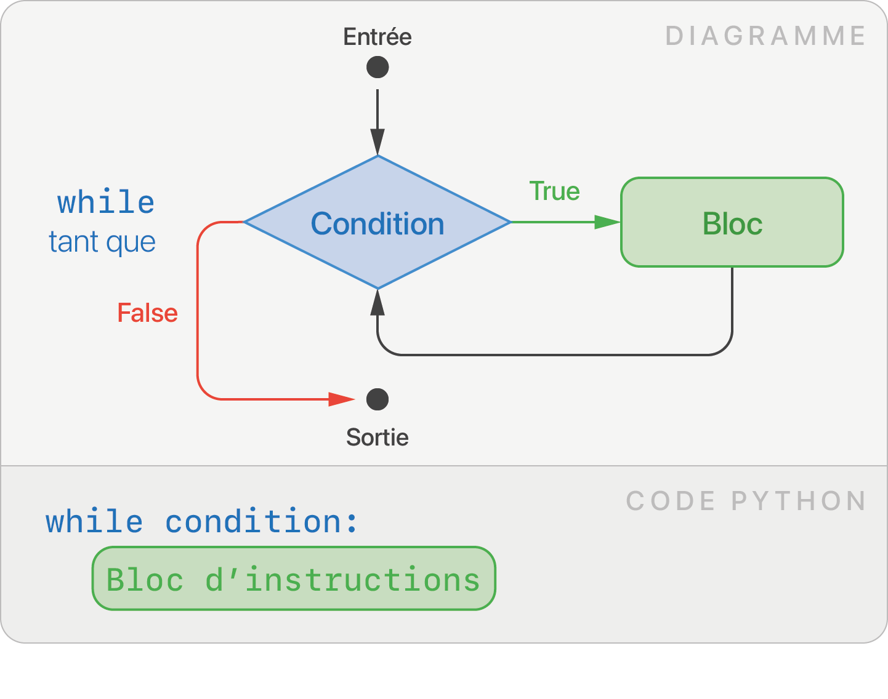
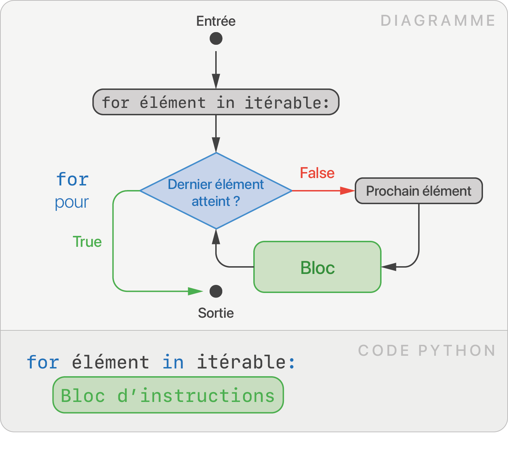
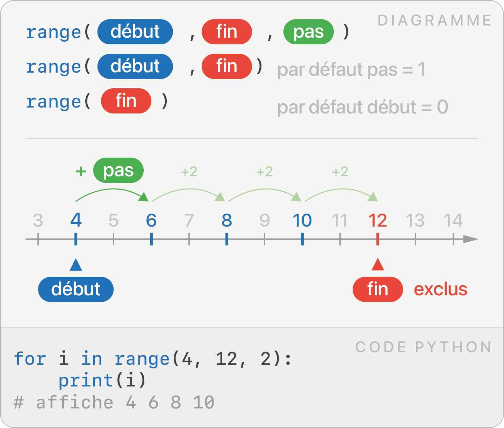

# Feuille de triche 

## :fontawesome-solid-shapes: Types et Valeurs

Un programme manipule des **valeurs**. Chaque valeur appartient à un **type** particulier.

??? note "Principaux types" 
    | Type             | Terme anglais | Signification                | Exemples de valeur                            |
    | ---------------- | ------------- | ---------------------------- | --------------------------------------------- |
    | `#!python int  ` | integer       | Nombre entier                | `#!python 45` `#!python -255` `#!python 1998` |
    | `#!python float` | float         | Nombre décimal (ou flottant) | `#!python 3.1412` `#!python -1.14152`         |
    | `#!python str  ` | string        | Chaîne de caractères (texte) | `#!python "Bonjour"` `#!python "42"`          |
    | `#!python bool ` | boolean       | Booléen                      | `#!python True` `#!python False`              |

??? note "Conversion entre types"

    Pour passer d'un type à l'autre, on utilise les fonctions `#!python int`,
    `#!python float`, `#!python str` ou `#!python bool`.

    ```py
    >>> int(17.6)  # float ► int
    17
    >>> int("42")  # str   ► int
    42
    >>> str(3.14)  # float ► str
    "3.14"
    ```

## :fontawesome-solid-box: Variables

Une variable **stocke** une valeur et est identifié par un **nom**.
Lors de l’évaluation d’une expression, le nom d’une variable est alors substitué par sa valeur actuelle.

```py
toto = 42  # affectation (initialisation)
toto = 56  # une nouvelle affectation écrase l'ancienne valeur
print(toto + 3)  # substitution, affiche 59
```

On parle d'**initialisation** lors de la première affectation. Le symbole `=` est l'opérateur d'affectation.

??? note "Opérateurs arithmétiques"

    | Opérateur arithmétique | Signification                              | Exemple              | Résultat        |
    | ---------------------- | ------------------------------------------ | -------------------- | --------------- |
    | `#!python +`           | Addition                                   | `#!python 10 + 3`    | `#!python 13`   |
    | `#!python -`           | Soustraction                               | `#!python 42 - 10.5` | `#!python 31.5` |
    | `#!python *`           | Multiplication                             | `#!python 7 * 8`     | `#!python 56`   |
    | `#!python /`           | Division                                   | `#!python 13 / 5`    | `#!python 2.6`  |
    | `#!python //`          | Division entière                           | `#!python 13 // 5`   | `#!python 2`    |
    | `#!python %`           | Reste dans la division entière (ou modulo) | `#!python 13 % 5`    | `#!python 3`    |
    | `#!python **`          | Puissance                                  | `#!python 4 ** 3`    | `#!python 64`   |

    Les calculs suivent la priorité usuelle des opérateurs.

    ```py title="Syntaxe abrégée"
    x += 10  # équivalent à x = x + 10
    x *= 2   # équivalent à x = x * 2
    x //= 2  # équivalent à x = x // 2
    # etc.
    ```

    Les opérateurs arithmétiques ont un sens différent suivant les types des valeurs manipulées :

    ```py
    "Oui" + "Non"  # concaténation, renvoie "OuiNon"
    "Oui" * 3  # renvoie "OuiOuiOui"
    ```

    C'est tout l'intérêt d'avoir différents types, la machine les traite différemment.


## :fontawesome-solid-display: :fontawesome-solid-keyboard: Sortie / Entrée

* La fonction `#!py print` permet d'**afficher** une ou plusieurs valeurs.

    ```py
    prénom = "Arthur"
    âge = 27
    print(prénom, "a exactement ", âge, "ans")
    ```

* La fonction `#!py input` récupère une **saisie utilisateur** au clavier. Elle renvoie une chaîne de caractères.

    ```py
    saisie = input("Rayon ?")  # input renvoie une chaîne de caractères
    rayon = float(saisie) # conversion vers un nombre décimal
    aire = 3.14 * rayon * rayon
    print("Aire du disque: ", rayon)
    ```

## :fontawesome-solid-circle-question: Conditions

Les structures conditionnelles permettent d'exécuter des blocs de code spécifiques suivant le résultat d'une condition.

??? note "Opérateurs de comparaison et d'appartenance"

    Ces opérateurs renvoient un **booléen** : `#!py True` ou `#!py False`.

    | Opérateurs de comparaison | Signification       | Exemple           | Résultat         |
    | ------------------------- | ------------------- | ----------------- | ---------------- |
    | `#!python ==`             | égal à              | `#!python 1 == 1` | `#!python True`  |
    | `#!python !=`             | différent de        | `#!python 1 != 1` | `#!python False` |
    | `#!python >`              | supérieur à         | `#!python 2 > 0`  | `#!python True`  |
    | `#!python >=`             | supérieur ou égal à | `#!python 4 >= 6` | `#!python False` |
    | `#!python <`              | inférieur à         | `#!python 5 < 5`  | `#!python False` |
    | `#!python <=`             | inférieur ou égal à | `#!python 5 <= 5` | `#!python True`  |


    | Opérateur d'appartenance | Signification       | Exemple           | Résultat         |
    | ------------------------- | ------------------- | ----------------- | ---------------- |
    | `#!python élément in itérable`             | `élément` est dans `itérable` | `#!python "t" in "chat"` | `#!python True`  |

??? note "Opérateurs logiques"

    Les opérateurs logiques permettent de **combiner** des conditions. Ils fonctionnent
    entre deux booléens.

    | Opérateurs logiques | Signification | Exemple                   | Résultat         |
    | ------------------- | ------------- | ------------------------- | ---------------- |
    | `#!python not`      | **non** logique   | `#!python not True`       | `#!python False` |
    | `#!python and`      | **et** logique    | `#!python False and True` | `#!python False` |
    | `#!python or`       | **ou** logique    | `#!python False or True`  | `#!python True`  |


| `#!py if`       | `#!py if else`       |  `#!py if elif else`       |
| :--------------: | :--------------: | :--------------: |
|     |  |  |

```py title="Exemple d'une structure conditionnelle"
note = int(input("Saisissez votre note au bac :"))
print("Votre mention est :")

if note >= 16:
    print("Félicitations")
elif note >= 14:
    print("Bien")
elif note >= 12:
    print("Assez Bien")
else:
    print("Pas de mention")
```

## :fontawesome-solid-repeat: Boucles

Une boucle est une structure de contrôle de flot qui permet de **répéter** un bloc de code.

### Boucle non-bornée `#!py while`

Lorsque le nombre de répétitions n'est pas connu à l'avance, la boucle `#!py while` permet de répéter un bloc d'instructions tant qu'une condition est vérifiée.

<figure markdown>
{ width="350px" }
</figure>


```py title="Combien de fois faut-il plier une feuille pour que son épaisseur dépasse la Tour Eiffel ?"
epaisseur = 0.0001
nombre_pliages = 0

while epaisseur < 324: 
    epaisseur = 2 * epaisseur
    nombre_pliages += 1

print("Il faut", nombre_pliages, "pliages.")
```


### Boucle bornée `#!py for`

La boucle `#!py for` parcourt un **itérable**, c'est-à-dire une structure de données qui peut être décomposée en une séquence d'éléments.

<figure markdown>
{ width="350px" }
</figure>

On dit que la variable `élément` parcourt `itérable`, elle va capturer chaque élément de l'itérable à chaque tour de boucle.

```py title="Exemple de parcours de plusieurs itérables" 
for caractere in "bonjour":
    print(caractere)

for i in range(5):
    print(i)

for elem in [1, 5, 17]:
    print(elem)
```

??? note "Générer une séquence d'entiers avec `#!py range`"
    <figure markdown>
    { width="350px" }
    </figure>

## Fonctions 

```py
# définition d'une fonction
def double(nombre):  # nombre est un paramètre / argument
    return nombre * 2  # return permet de renvoyer une valeur

résultat = double(21)  # appel de la fonction 
print(résultat)  # affiche 42
```

## :fontawesome-solid-bag-shopping: Conteneurs

### Tableau `#!py list`

* Opérations de base :

    ```py
    tab = [3, 4, 58, 10, 2]

    # Accès à un élément grâce à son indice
    print(tab[2]) # affiche 58
    tab[2] = 999  # tab vaut [3, 4, 999, 10, 2]

    # Taille d'une liste
    print(len(tab))  # affiche 5

    # Ajouter/retirer un élément
    tab.append(42) # tab vaut [3, 4, 999, 10, 2, 42]
    tab.remove(10) # tab vaut [3, 4, 999, 2, 42]
    ```

* Créer un tableau :
    ```py
    # Création explicite
    tab = [3, 4, 58, 10, 2]

    # Création à partir d'un autre itérable
    tab = list(range(6))  # tab vaut [0, 1, 2, 3, 4, 5]
    tab = list("salut")   # tab vaut ['s', 'a', 'l', 'u', 't']

    # Création à partir d'une liste vide
    tab = []  # liste vide
    for i in range(5):
        tab.append(i * i)
    # tab vaut [0, 1, 4, 9, 16]

    # Liste en compréhensions
    tab = [i * i for i in range(5)]  # tab vaut [0, 1, 4, 9, 16]
    tab_pair = [n for n in tab if n % 2 == 0]  # (filtre) tab_pair vaut [0, 4, 16] 
    ```

* Parcourir un tableau :

    ```py
    for élément in tab:  # parcours par élément
        print(élément)

    for i in range(len(tab)):  # parcours par indice
        print(tab[i])
    ```

### Dictionnaire `#!py dict`


## Bibliothèques

## Compléments