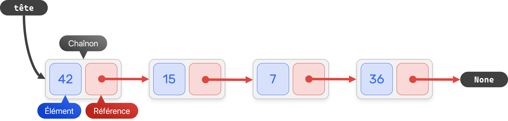

# Les piles

## Introduction

Une **structure de données** est une manière d'organiser des données pour les manipuler plus facilement. En première, vous avez manipulé les trois structures de données les plus courantes, à savoir les tableaux (`#!py list`), les dictionnaires (`#!py dict`) et les n-uplets (`#!py tuple`).

Une **interface** décrit un ensemble de méthodes (ou opérations, ou primitives) abstraites qu'une structure de données doit offrir, établissant ainsi une sorte de contrat avec l'utilisateur de cette structure. Peu importe la manière dont une telle structure est implémentée, son interface demeure inchangée.

On se propose alors d'implémenter une nouvelle structure de données, la **pile**, et de l'utiliser concrètement sur des problèmes classiques.

## Description

Une pile est une structure de données linéaire et dynamique. Elle est fondée sur le principe du « *dernier entré, premier sorti* » (en anglais « *Last In, First Out* », LIFO). C’est le principe même de la pile d’assiettes : c’est la dernière assiette posée sur la pile d’assiettes sales qui sera la première lavée. En programmation, on parle d'éléments plutôt que d'assiettes.

{: style='width: 100%'}

Ces éléments sont supposés de même type, la pile est une structure de données dites homogène.

## Interface

On se propose d'implémenter une pile par le biais d'une classe.

| Opération     | Description                                                         |
| ------------- | ------------------------------------------------------------------- |
| Constructeur  | Créer une pile vide.                                                |
| `pile.empiler(e)` | Ajoute l'élément `e` au sommet de la pile.                          |
| `pile.dépiler()`  | Renvoie l'élément au sommet de la pile et le supprime.              |
| `pile.est_vide()` | Renvoie `True` si la pile ne contient aucun élément, `False` sinon. |
| `pile.sommet()`   | Renvoie l'élément au sommet de la pile sans le supprimer.           |
| `pile.taille()`   | Renvoie le nombre d'éléments dans la pile.                          |

```py title="Exemple d'utilisation d'une pile"
>>> p = Pile()  # la pile p est vide
>>> p.empiler(12)
>>> p.empiler(14)
>>> p.empiler(18)
>>> p.empiler(17)  # la pile p est composée des éléments 12, 14, 18, 17
>>> p.sommet()
17
>>> p.taille()
4
>>> p.dépiler()  # # la pile p est composée des éléments 12, 14, 18
17
>>> p.dépiler()  # # la pile p est composée des éléments 12, 14
18
>>> p.taille()
2
>>> p.est_vide()
False
>>> p.dépiler()
14
>>> p.dépiler()
12
>>> p.est_vide()
True
```


!!! question "Exercices"
    1. Soit une pile composée des éléments suivants (par ordre d'ajout) : `#!py "chat"`, `#!py "zèbre"`, `#!py "gnou"`, `#!py "chien"`, `#!py "oiseau"` et `#!py "ornithorynque"`. Quel est l'effet de l'instruction `dépiler` sur cette pile ?

    2. Qu'affiche le programme suivant ?

        ```py
        p = Pile()
        for i in range(5):
            p.empiler(i * i)
        a = p.dépiler()
        print(a)
        print(p.taille())
        ```

## Implémentation à partir d'un tableau dynamique

Finalement, une pile ressemble à tableau dynamique (`#!py list`) plus contraignant. La méthode `.append` des listes ressemble à la méthode `.empiler` des piles et la méthode `.pop` des listes ressemble à la méthode `.dépiler` des piles.

!!! question "Exercice"
    Implémenter la classe `Pile` en utilisant une liste comme conteneur des éléments. 

```py
class Pile:
    def __init__(self):
        self.éléments = []
    
    def empiler(self, nouvel_élément):
        # à compléter

    def dépiler(self):
        # à compléter

    # définir les autres primitives 
```

??? success "Correction – Implémentation d'une pile à partir d'un tableau dynamique"

    ```py
    class Pile:
        def __init__(self):
            """ Initialise une pile vide. """
            self.éléments = []

        def empiler(self, nouvel_élément):
            """ Ajoute l'élément nouvel_élément au sommet de la pile. """
            self.éléments.append(nouvel_élément)

        def dépiler(self):
            """ Renvoie l'élément au sommet de la pile et le supprime. """
            return self.éléments.pop()

        def est_vide(self):
            """ Renvoie True si la pile ne contient aucun élément, False sinon. """
            return not self.éléments

        def sommet(self):
            """ Renvoie l'élément au sommet de la pile sans le supprimer. """
            return self.éléments[-1]

        def taille(self):
            """ Renvoie le nombre d'éléments dans la pile. """
            return len(self.éléments)
    ```


## Exercices

### Parfaitement équilibré... comme tout devrait être.

Écrire une fonction `#!py bien_parenthésée(expression: str) -> bool` qui vérifie si l'expression mathématique `expression` (donnée sous forme d'une chaîne de caractères) est correctement parenthésée en utilisant une pile.

```py title="Exemple de sortie"
>>> bien_parenthésée("(..(..)..)")
True
>>> bien_parenthésée("(..)..)")
False
>>> bien_parenthésée("..)(..")
False
>>> bien_parenthésée("(..(..(..)..)")
False
```

??? note "Algorithme"

    1. On créer une pile vide
    2. On parcourt l'expression caractère par caractère :
    
        * Si on rencontre une parenthèse ouvrante `#!py '('`, on l'empile.
    
        * Si on rencontre une parenthèse fermante `#!py ')'` on dépile si la pile n'est pas vide, sinon on renvoie faux.
    
    3. Le parenthésage est correct si et seulement si la pile est vide.

### Implémentation à partir d'un tableau statique

Implémenter une pile à partir d'un tableau **statique** (de taille fixe). L'implémentation ne doit donc pas utiliser la méthode `.append` et `.pop` des listes. 

```py title="Début de l'implémentation"
class Pile:
    def __init__(capacité: int):
        self.capacité = capacité  # nombre maximum d'éléments dans la pile
        self.éléments = [None] * capacité
        self.taille = 0
        self.indice_sommet = -1  # indice de l'élément au sommet, -1 est une valeur symbolique ici
```

Compléter le reste des méthodes d'une pile.

### Dzień dobry!

La *notation polonaise inverse* (NPI), également connue sous le nom de *notation post-fixée*, permet d'écrire de façon non ambiguë des expressions arithmétiques sans utiliser de parenthèses.

| Notation usuelle | Notation polonaise inversé |
| :--------------- | :--- |
| $5 + 10$ | $\texttt{5 10 +}$ |
| $3 \times (4 + 7)$ | $\texttt{4 7 + 3 *}$ |
| $(10 + 4) - 2$ | $\texttt{10 4 + 2 -}$ |
| $(1 + 2) \times (3 - 6)$ | $\texttt{1 2 + 6 3 - *}$ |

Les calculatrices NPI se reposent sur l'utilisation d'une pile, en d'autres termes les opérandes sont disposées au sommet de la pile, tandis que les résultats des calculs sont retournés aussi au sommet de la pile.

{: style='width: 100%'}

Écrire une fonction `#!py calculer_npi(expression: str)` qui prend en paramètre une expression `expression` (sous la forme d'une chaîne de caractère) en notation polonaise inversée et qui renvoie le résultat de l'expression.

```py
>>> calculer_npi("3 10 5 + *")
45.0
```

??? note "Astuces"
    * La méthode `.split` permet de scinder une chaîne de caractères suivant un caractère spécifique : 
        ```py
        >>> "jean-hubert-de-pons".split("-")
        ['jean', 'hubert', 'de', 'pons']
        >>> "3 10 5 + *".split() # par défaut, scinde sur les espaces
        ['3', '10', '5', '+', '*']
        ```
        Sauriez-vous recoder une telle fonction ?

    * Pour tester si une chaîne de caractères est numérique, on peut tenter de la convertir en `#!py float`, si cela échoue alors c'est une valeur non-numérique :
        ```py
        def est_numérique(chaine: str) -> bool:
            """ Renvoie True si chaine peut être converti en float, False sinon. """
            try:  # try = essayer
                float(chaine)  # renvoie une exception si chaine n'est pas convertible en float
                return True
            except:  # bloc exécuté si une exception survient
                return False
        ```

        Si la structure `#!py try except` n'est pas au programme, elle se relève bien utile ici.

        ```py
        >>> est_numérique("5")
        True
        >>> est_numérique("-42.3")
        True
        >>> est_numérique("chat")
        False
        >>> est_numérique("+")
        False
        ```

        Une autre implémentation de `est_numérique` serait de parcourir la chaîne pour déterminer si elle est constituée de chiffres et éventuellement, contient une virgule ou est précédée d'un signe.

Une fois les opérateurs arithmétiques classiques implémentées (addition, soustraction, multiplication...), il serait intéressant de considérer des opérateurs comme la racine carrée, le cosinus etc.

## Implémentation d'une pile à partir d'une liste chaînée

### Clarification sur les références

Vous avez sûrement déjà eu envie de copier une liste de cette manière :

```py title="Une copie malheureuse"
>>> a = [1, 2, 3, 4]
>>> b = a
>>> b.append(5)
>>> a
[1, 2, 3, 4, 5]
```

Aïe, la liste `a` a été modifiée, mais pourquoi ? Vidéo explicative.

{: style='width: 100%'}

On retient que, en Python, tous les objets (tout excepté les entiers et les flottants finalement) sont manipulés par **référence**.

### Implémentation d'une liste chaînée

Une liste chaînée est une structure de données linéaire où chaque chaînon contient :

* un élément 
* une référence vers le chaînon suivant

Une telle structure ne stockera alors que la référence du premier chaînon, appelé tête.

<figure markdown>

</figure>

Contrairement à un tableau dynamique, les éléments ne sont plus stockés linéairement dans la mémoire. Si l'opération d'insertion et de suppression d'un élément se déroule en temps constant, l'accès au $i$-ème élément d'une liste chaînée s'effectue en contrepartie en temps linéaire.

```py
class Chaînon:
    def __init__(self, élément, chaînon_suivant):
        self.élément = élément
        self.suivant = chaînon_suivant

class ListeChaînée:
    def __init__(self):
        """ Initialise une liste chaînée vide. """
        self.tête = None

    def insérer_devant(self, élément):
        """ Insère un nouvel élément à la tête de la liste. """
        chaînon = Chaînon(élément, self.tête)  #(1)!
        self.tête = chaînon  #(2)!

    def est_vide(self):
        """ Renvoie True si la liste ne contient aucun élément, False sinon. """
        return self.tête is None

    def retirer_tête(self):
        """ Retire le premier élément de la liste. """
        if self.est_vide():
            return None
        self.tête = self.tête.suivant  #(3)! 
    
    def tête(self):
        """ Renvoie l'élément du premier élément de la liste. """
        pass

    def taille(self):
        """ Renvoie le nombre d'éléments de la liste. """
        pass

    def afficher(self):
        """ Affiche les éléments de la liste. """
        pass
```

1. On crée un nouveau chaînon que l'on connecte au premier chaînon de notre liste.
2. On met à jour la tête de notre liste.
3. Puisque le chaînon que l'on déconnecte ne sera plus accessible dans le programme, Python le supprimera de la mémoire (par le biais du garbage collector).

??? question "Exercices"
    1. Compléter les trois dernières méthodes.

        ```py title="Exemple d'utilisation d'une liste chaînée"
        >>> l = ListeChaînée()
        >>> l.insérer_devant(36)
        >>> l.insérer_devant(7)
        >>> l.insérer_devant(15)
        >>> l.insérer_devant(42)
        >>> l.afficher()
        42 -> 15 -> 7 -> 36
        >>> l.taille()
        4
        >>> l.tête()
        42
        >>> l.retirer_tête()
        >>> l.afficher()
        15 -> 7 -> 36
        ```

    2. Quelle est la complexité en temps du calcul de la taille de la liste ? Quel attribut aurait-on pu ajouter à `ListeChaînée` pour améliorer cette complexité ? 

### Implémentation d'une pile à partir d'une liste chaînée

Implémenter une pile à partir d'une liste chaînée dans une nouvelle classe `PileListeChaînée`. 