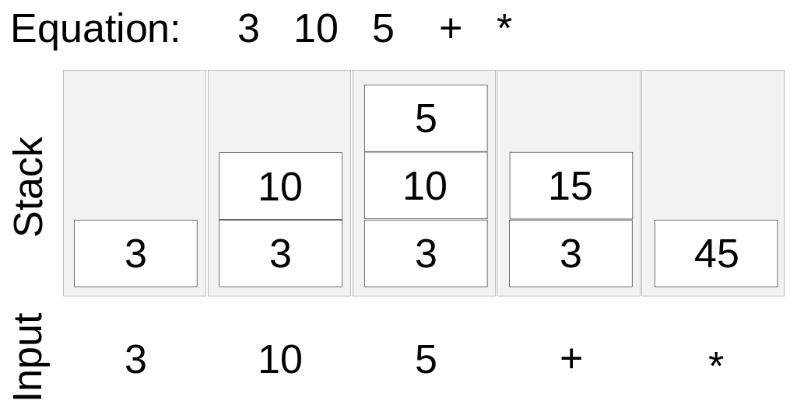

# Les piles

## Introduction

Une **structure de données** est une manière d'organiser des données pour les manipuler plus facilement. En première, vous avez manipulé les trois structures de données les plus courantes, à savoir les tableaux (`#!py list`), les dictionnaires (`#!py dict`) et les n-uplets (`#!py tuple`).

Une **interface** décrit un ensemble de méthodes (ou opérations, ou primitives) abstraites qu'une structure de données doit offrir, établissant ainsi une sorte de contrat avec l'utilisateur de cette structure. Peu importe la manière dont une telle structure est implémentée, son interface demeure inchangée.

On se propose alors d'implémenter une nouvelle structure de données, la **pile**, et de l'utiliser concrètement sur des problèmes classiques.

## Description

Une pile est une structure de données linéaire et dynamique. Elle est fondée sur le principe du « *dernier entré, premier sorti* » (en anglais « *Last In, First Out* », LIFO). C’est le principe même de la pile d’assiettes : c’est la dernière assiette posée sur la pile d’assiettes sales qui sera la première lavée. En programmation, on parle d'éléments plutôt que d'assiettes.

{: style='width: 100%'}

Ces éléments sont supposés de même type, la pile est une structure de données dites homogène.

## Interface

On se propose d'implémenter une pile par le biais d'une classe.

| Opération     | Description                                                         |
| ------------- | ------------------------------------------------------------------- |
| Constructeur  | Créer une pile vide.                                                |
| `pile.empiler(e)` | Ajoute l'élément `e` au sommet de la pile.                          |
| `pile.dépiler()`  | Renvoie l'élément au sommet de la pile et le supprime.              |
| `pile.est_vide()` | Renvoie `True` si la pile ne contient aucun élément, `False` sinon. |
| `pile.sommet()`   | Renvoie l'élément au sommet de la pile sans le supprimer.           |
| `pile.taille()`   | Renvoie le nombre d'éléments dans la pile.                          |

```py title="Exemple d'utilisation d'une pile"
>>> p = Pile()  # la pile p est vide
>>> p.empiler(12)
>>> p.empiler(14)
>>> p.empiler(18)
>>> p.empiler(17)  # la pile p est composée des éléments 12, 14, 18, 17
>>> p.sommet()
17
>>> p.taille()
4
>>> p.dépiler()  # # la pile p est composée des éléments 12, 14, 18
17
>>> p.dépiler()  # # la pile p est composée des éléments 12, 14
18
>>> p.taille()
2
>>> p.est_vide()
False
>>> p.dépiler()
14
>>> p.dépiler()
12
>>> p.est_vide()
True
```

!!! question "Exercices"
    1. Soit une pile composée des éléments suivants (par ordre d'ajout) : `#!py "chat"`, `#!py "zèbre"`, `#!py "gnou"`, `#!py "chien"`, `#!py "oiseau"` et `#!py "ornithorynque"`. Quel est l'effet de l'instruction `dépiler` sur cette pile ?

    2. Qu'affiche le programme suivant ?

        ```py
        p = Pile()
        for i in range(5):
            p.empiler(i * i)
        a = dépiler(p)
        print(a)
        print(p.taille())
        ```

## Implémentation à partir d'un tableau dynamique

Finalement, une pile ressemble à tableau dynamique (`#!py list`) plus contraignant. La méthode `.append` des listes ressemble à la méthode `.empiler` des piles et la méthode `.pop` des listes ressemble à la méthode `.dépiler` des piles.

!!! question "Exercice"
    Implémenter la classe `Pile` en utilisant une liste comme conteneur des éléments. 

```py
class Pile:
    def __init__(self):
        self.éléments = []
    
    def empiler(self, nouvel_élément):
        # à compléter

    def dépiler(self):
        # à compléter

    # définir les autres primitives 
```

## Implémentation à partir d'une liste chaînée

À compléter !

## Exercices

### Parfaitement équilibré... comme tout devrait être.

Écrire une fonction `#!py bien_parenthésée(expression: str) -> bool` qui vérifie si l'expression mathématique `expression` (donnée sous forme d'une chaîne de caractères) est correctement parenthésée en utilisant une pile.

```py title="Exemple de sortie"
>>> bien_parenthésée("(..(..)..)")
True
>>> bien_parenthésée("(..)..)")
False
>>> bien_parenthésée("..)(..")
False
>>> bien_parenthésée("(..(..(..)..)")
False
```

??? note "Algorithme"

    1. On créer une pile vide
    2. On parcourt l'expression caractère par caractère :
    
        * Si on rencontre une parenthèse ouvrante `#!py '('`, on l'empile.
    
        * Si on rencontre une parenthèse fermante `#!py ')'` on dépile si la pile n'est pas vide, sinon on renvoie faux.
    
    3. Le parenthésage est correct si et seulement si la pile est vide.

### Implémentation à partir d'un tableau statique

Implémenter une pile à partir d'un tableau **statique** (de taille fixe). L'implémentation ne doit donc pas utiliser la méthode `.append` et `.pop` des listes. 

```py title="Début de l'implémentation"
class Pile:
    def __init__(capacité: int):
        self.éléments = [None] * capacité
        self.taille = 0
        self.indice_sommet = -1  # indice de l'élément au sommet
```

### Dzień dobry!

La *notation polonaise inverse* (NPI), également connue sous le nom de *notation post-fixée*, permet d'écrire de façon non ambiguë des expressions arithmétiques sans utiliser de parenthèses.

| Notation usuelle | Notation polonaise inversé |
| :--------------- | :--- |
| $5 + 10$ | $\texttt{5 10 +}$ |
| $3 \times (4 + 7)$ | $\texttt{4 7 + 3 *}$ |
| $(10 + 4) - 2$ | $\texttt{10 4 + 2 -}$ |
| $(1 + 2) \times (3 - 6)$ | $\texttt{1 2 + 3 6 - *}$ |

Les calculatrices NPI se reposent sur l'utilisation d'une pile, en d'autres termes les opérandes sont disposées au sommet de la pile, tandis que les résultats des calculs sont retournés aussi au sommet de la pile.

<figure markdown>
{ width=300 }
</figure>

Écrire une fonction `#!py calculer_npi(expression: str)` qui prend en paramètre une expression `expression` (sous la forme d'une chaîne de caractère) en notation polonaise inversée et qui renvoie le résultat de l'expression.

```py
>>> calculer_npi('3 10 5 + *')
45
```

