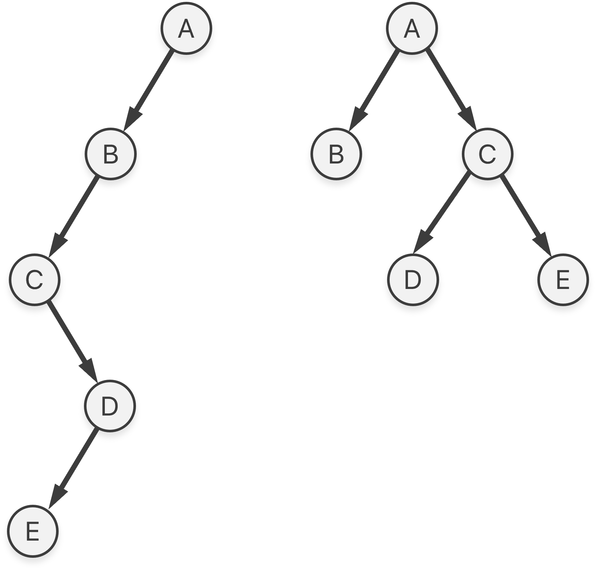
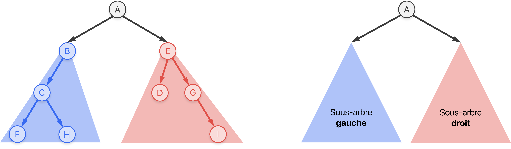

# Les arbres binaires

!!! info "Liens Capytale"
    * À la découverte des arbres binaires : [:fontawesome-solid-link: Notebook Capytale ac40-3104814](https://capytale2.ac-paris.fr/web/c/ac40-3104814)
    * Les parcours des arbres binaires : [:fontawesome-solid-link: Notebook Capytale e6d0-3126581](https://capytale2.ac-paris.fr/web/c/e6d0-3126581)
    * Les arbres binaires de rechercher : [:fontawesome-solid-link: Notebook Capytale ddd2-3129906](https://capytale2.ac-paris.fr/web/c/ddd2-3129906)

## Définitions

* Un **arbre** est un graphe connexe et sans cycle. C'est une structure de données **hiérarchique**. 

* Vocabulaire associé :  
    { width="75%" .center}

    !!! warning "Définition ambiguë"
        Attention à la définition vague de la profondeur d'un nœud et, par conséquent, de la hauteur d'un arbre ! Deux conventions existent. La profondeur d'un nœud est soit le nombre d'arêtes, soit le nombre de nœuds sur le chemin de la racine à ce nœud. L'exemple utilise cette dernière convention. La hauteur est définie comme la profondeur maximale atteinte par un nœud de l'arbre.

* Un **arbre binaire** est un arbre où chaque nœud possède au plus deux fils ; un fils gauche et un fils droit.

    { width="25%" .center}

* Un arbre binaire est dit filiforme si la hauteur est maximale et **équilibré** si la hauteur est minimale. 

    { width="25%" .center}


* Soit un arbre binaire de taille $n$ (son nombre de nœuds), alors sa hauteur $h$ (suivant la convention précédente) vérifie :
    
    $$\big\lceil \log_2 \left( n + 1 \right) \big\rceil \leq h \leq n$$

    On retient qu'un arbre équilibré avec $n$ nœuds a une hauteur $O(\ln n)$.

* Implémentation minimale d'un arbre binaire :

    ```py
    class Noeud:
        def __init__(self, valeur, noeud_gauche, noeud_droit):
            self.valeur = valeur       # (1)! 
            self.gauche = noeud_gauche # (2)!
            self.droit  = noeud_droit  # (3)!

    class ArbreBinaire:
        def __init__(self, racine: Noeud):
            self.racine = racine # (4)! 
    ```

    1. Une valeur associée à un nœud (un nombre, une chaîne de caractères etc.)
    2. Une référence vers le nœud fils **gauche**. `None` s'il n'existe pas.
    3. Une référence vers le nœud fils **droit**. `None` s'il n'existe pas.
    4. Il est notable de remarquer qu'un arbre ne conserve qu'une référence vers sa racine, car on peut accéder à tous les autres nœuds depuis la racine grâce à un parcours. C'est un peu comme les listes chaînées où l'on ne conservait qu'une référence vers le chaînon « tête ».

##  Algorithmes classiques

* La plupart des algorithmes sur les arbres binaires sont **récursifs**, car un arbre binaire est une structure de données récursive.

    { width="75%" .center}

    Chaque nœud d'un arbre peut être vu comme la racine d'un sous-arbre ! Il est alors assez courant de confondre les notions de nœuds et d'arbres. Par exemple, l'arbre « C » est le sous-arbre de racine C.

* La taille d'un arbre $A$ (son nombre de nœuds) peut être définie récursivement comme :

    $$
    \text{taille}(A)= \begin{cases}
    0 & \text{si} \ A = \varnothing \\
    1 + \text{taille}(A_g) + \text{taille}(A_d)& \text{sinon}
    \end{cases}
    $$

    Où $A_g$ (resp. $A_d$) est le sous-arbre gauche (resp. droit) de $A$. L'implémentation en Python est alors immédiate :

    ```py
    def taille(racine: Noeud):
        """ Renvoie la taille de l'arbre dont la racine est `racine` """
        if racine is None:
            return 0
        else:
            return 1 + taille(racine.gauche) + taille(racine.droit)

    def taille_arbre(arbre: ArbreBinaire):
        """ Permet à l'utilisateur d'écrire `taille_arbre(A)` plutôt que `taille(A.racine)` """
        return taille(arbre.racine)
    ```