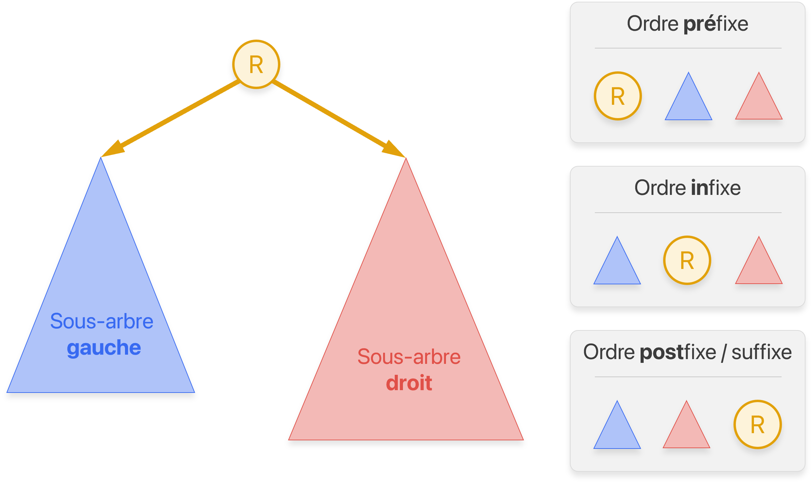

# Les arbres binaires

!!! info "Liens Capytale"
    * À la découverte des arbres binaires : [:fontawesome-solid-link: Notebook Capytale ac40-3104814](https://capytale2.ac-paris.fr/web/c/ac40-3104814)
    * Les parcours des arbres binaires : [:fontawesome-solid-link: Notebook Capytale e6d0-3126581](https://capytale2.ac-paris.fr/web/c/e6d0-3126581)
    * Les arbres binaires de recherche : [:fontawesome-solid-link: Notebook Capytale ddd2-3129906](https://capytale2.ac-paris.fr/web/c/ddd2-3129906)

## Définitions

* Un **arbre** est un graphe connexe et sans cycle. C'est une structure de données **hiérarchique**. 

* Vocabulaire associé :  
    { width="75%" .center}

    !!! warning "Définition ambiguë"
        Attention à la définition vague de la profondeur d'un nœud et, par conséquent, de la hauteur d'un arbre ! Deux conventions existent. La profondeur d'un nœud est soit le nombre d'arêtes, soit le nombre de nœuds sur le chemin de la racine à ce nœud. L'exemple utilise cette dernière convention. La hauteur est définie comme la profondeur maximale atteinte par un nœud de l'arbre.

* Un **arbre binaire** est un arbre où chaque nœud possède au plus deux fils ; un fils gauche et un fils droit.

    { width="25%" .center}

* Un arbre binaire est dit filiforme si la hauteur est maximale et **équilibré** si la hauteur est minimale. 

    { width="25%" .center}


* Soit un arbre binaire de taille $n$ (son nombre de nœuds), alors sa hauteur $h$ (suivant la convention précédente) vérifie :
    
    $$\big\lceil \log_2 \left( n + 1 \right) \big\rceil \leq h \leq n$$

    On retient qu'un arbre équilibré avec $n$ nœuds a une hauteur d'environ $\log_2(n)$.

* Implémentation minimale d'un arbre binaire :

    ```py
    class Noeud:
        def __init__(self, valeur, noeud_gauche, noeud_droit):
            self.valeur = valeur       # (1)! 
            self.gauche = noeud_gauche # (2)!
            self.droit  = noeud_droit  # (3)!
    ```


    1. Une valeur associée à un nœud (un nombre, une chaîne de caractères etc.)
    2. Une référence vers le nœud fils **gauche**. `None` s'il n'existe pas.
    3. Une référence vers le nœud fils **droit**. `None` s'il n'existe pas.

    Chaque nœud d'un arbre peut être vu comme la racine d'un sous-arbre ! Il est alors assez courant de confondre les notions de nœuds et d'arbres.

##  Algorithmes classiques

* La plupart des algorithmes sur les arbres binaires sont **récursifs**, car un arbre binaire est une structure de données récursive.

    { width="75%" .center}


* La taille d'un arbre $A$ (son nombre de nœuds) peut être définie récursivement comme :

    $$
    \text{taille}(A)= \begin{cases}
    0 & \text{si} \ A = \varnothing \\
    1 + \text{taille}(A_g) + \text{taille}(A_d)& \text{sinon}
    \end{cases}
    $$

    Où $A_g$ (resp. $A_d$) est le sous-arbre gauche (resp. droit) de $A$. L'implémentation en Python est alors immédiate :

    ```py
    def taille(racine: Noeud):
        """ Renvoie la taille de l'arbre dont la racine est `racine` """
        if racine is None:
            return 0
        else:
            return 1 + taille(racine.gauche) + taille(racine.droit)
    ```

* La hauteur d'un arbre $A$ :
 
    $$
    \text{hauteur}(A)= \begin{cases}
    0 & \text{si} \ A = \varnothing \\
    1 + \max\Big( \text{hauteur}(A_g),\ \text{hauteur}(A_d) \Big) & \text{sinon}
    \end{cases}
    $$

    ```py
    def hauteur(racine: Noeud):
        """ Renvoie la hauteur de l'arbre dont la racine est `racine` """
        if racine is None:
            return 0
        else:
            return 1 + max(hauteur(racine.gauche), hauteur(racine.droit))
    ```

## Parcours en profondeur d'un arbre binaire

* Il existe trois parcours en profondeur d'un arbre binaire suivant l'ordre de visite de la racine d'un sous-arbre :

    { width="75%" .center}


* Finalement, en terme de code, il suffit de déplacer une simple ligne de code :

    ```py title="Décommenter la ligne suivant le parcours souhaité"
    def parcours(racine: Noeud):
        if racine is not None:
            # print(racine.valeur) # Parcours préfixe
            parcours(racine.gauche)
            # print(racine.valeur) # Parcours infixe
            parcours(racine.droit)
            # print(racine.valeur) # Parcours suffixe
    ```

* Le parcours **préfixe** est le parcours en profondeur classique. Le parcours **infixe** sera utile pour afficher les valeurs d'un ABR dans l'ordre.

## Arbre Binaire de Recherche (ABR)

* Un **Arbre Binaire de Recherche** (ABR) est un arbre binaire où la valeur (qu'on appelle **clé**) de chaque nœud est inférieure à toutes les valeurs dans son sous-arbre droit et supérieure à toutes les valeurs dans son sous-arbre gauche.

    { width="75%" .center}

    Le parcours **infixe** permet de traiter les nœuds par ordre croissant.

* Cette structure de données permet de maintenir des valeurs triées (et donc de rechercher rapidement une valeur grâce à une recherche dichotomique) et d'insérer de manière efficiente de nouvelles valeurs.

<center>

|    Structure     |   Complexité moyenne <br/> `insérer`    |  Complexité moyenne <br/> `rechercher`  |
| :--------------: | :-------------------------------: | :-------------------------------: |
| Tableau non-trié |   <div class="o1">$O(1)$</div>    |   <div class="on">$O(n)$</div>    |
|   Tableau trié   |   <div class="on">$O(n)$</div>    | <div class="o1">$O(\log n)$</div> |
|       ABR        | <div class="o1">$O(\log n)$</div> | <div class="o1">$O(\log n)$</div> |

<center/>