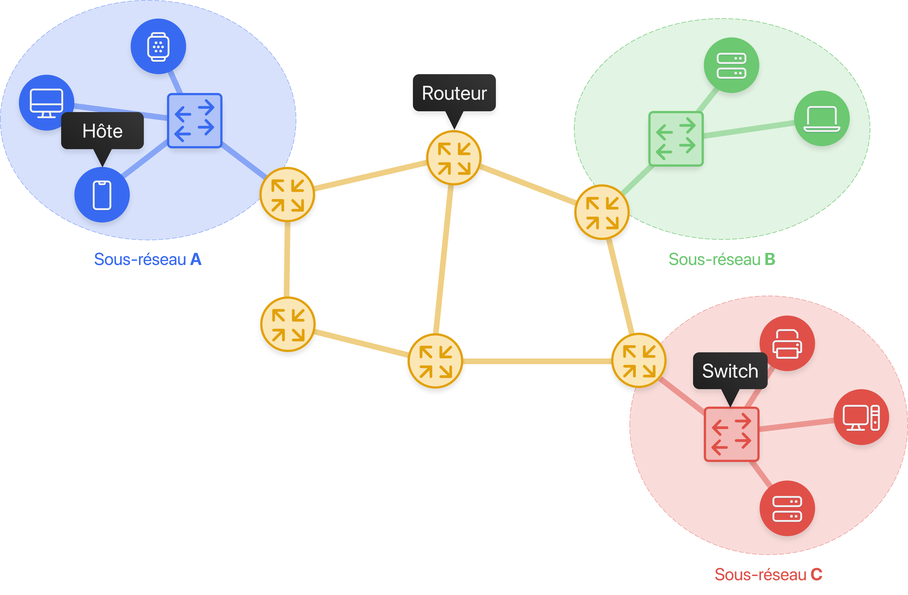
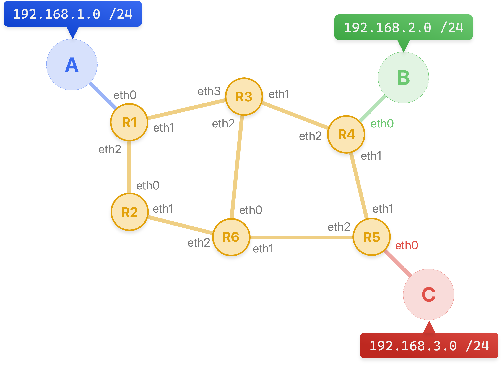

# Le routage

!!! info "Document Réponse Capytale"
    Capytale buggue ces derniers jours, le document réponse arrive promis 🙏 Pendant ce temps, utiliser un document texte (Google Doc, Notepad etc.).

## Rappels

Les machines (ou hôtes) d'un même sous-réseau communiquent grâce à un **switch** (ou commutateur en français). Pour que deux machines de sous-réseaux différents communiquent, les sous-réseaux sont interconnectés par des **routeurs**. Un routeur est une machine qui redirige les paquets au sein d'un réseau pour qu'ils arrivent à destination.

{ width="75%" }

Le but de ce chapitre est de comprendre comment les routeurs parviennent à rediriger les paquets.

## Table de routage

Pour se concentrer sur le routage des paquets, un tel réseau peut aussi se représenter comme :

{ width="75%" }

Lorsqu'un routeur reçoit un paquet, il utilise sa **table de routage** pour déterminer le prochain nœud vers lequel le paquet doit être dirigé. Par exemple, la table de routage du routeur **R1** peut être écrite comme :

| Réseau destination | Prochain routeur | Interface Ethernet |
| :----------------: | :--------------: | :----------------: |
|         A          |        -         |        eth0        |
|         B          |        R3        |        eth1        |
|         C          |        R2        |        eth2        |

??? question "Question 1"
    1. Que fait le routeur **R1** lorsqu'il reçoit le paquet suivant ?
          * IP Source : `192.168.1.120`
          * IP Destination : `192.168.3.88`    

    2. Proposer deux tables de routage possibles pour le routeur **R3**.
    3. Le routeur **R3** tombe en panne, comment est modifiée la table de routage du routeur **R1** ?

## Routage manuel sur 3 routeurs

Sur le logiciel Filius, configurer le réseau suivant :

!!! note "Un peu de vocabulaire"
    * Les routeurs R1 et R3 sont appelés **routeurs d'accès**, car ils sont en bordure de réseaux.

    * Le routeur R2 est un **routeur interne**.

La table de routage initiale du routeur R1 :

??? question "Question 2"
    Chercher sur le web la signification de loopback (ou rebouclage), comment ce principe s'applique-t-il ici ?

Indiquons au routeur R1 la direction que devra prendre un paquet à destination du réseau `192.168.1.0/24` (tout à droite) :

* Ajouter une nouvelle ligne à la table de routage de R1
* Compléter alors les champs :
    * IP de destination : `192.168.1.0/24`
    * Masque : `255.255.255.0`
    * Passerelle suivante : `1.0.0.2`
    * Via l'interface : `1.0.0.1`

* Tester à partir de P1 et la commande ping `192.168.1.0`.

??? question "Questions 3"
    1. Le paquet est-il transmis à P2 ? Vous pouvez ouvrir les fenêtres d'échanges de données nécessaires.
   
    2. Compléter et donner les tables de routages de R2 et et R3 pour que la commande ping fonctionne correctement.

Nous allons modifier la topologie du réseau, en ajoutant un routeur R4 et un portable P3 de la manière suivante (le portable P1 et le routeur R1 sont inchangés) :

!!! tip "Astuce"
    Si vous êtes à cours de prises réseaux sur certains routeurs, vous pouvez en ajouter de nouvelles via le bouton "Gérer les connexions".

??? question "Question 4"
    Modifiez les tables de routages nécessaires pour que les 3 portables puissent communiquer. Télécharger le fichier du réseau et le remettre au professeur !

Même pour des réseaux de petites taille, il est difficile de maintenir des tables de routages manuellement. Dès que le nombre de routeurs internes augmente, arrivent d'autres questions :

Dans une telle situation, quelle route est à privilégier pour relier le client au serveur ?
 
* `R1 ► R2 ► R3 ► R5 ► R6`
* `R1 ► R2 ► R4 ► R5 ► R6`
* `R1 ► R2 ► R5 ► R6`
 
Nous aurions tendance à penser naturellement qu'il faut prendre la troisième solution, pour laquelle un saut de moins est nécessaire, mais est-ce judicieux si les liaisons `R2 ► R3 ► R5` sont fibrées alors que la liaison `R2 ► R5` est une liaison cuivre classique ?

<iframe width="560" height="315" src="https://www.youtube.com/embed/sT9-IcbjqzI?si=q5-oMpYrmx4zRUjx" title="YouTube video player" frameborder="0" allow="accelerometer; autoplay; clipboard-write; encrypted-media; gyroscope; picture-in-picture; web-share" referrerpolicy="strict-origin-when-cross-origin" allowfullscreen style="width: 75%; border-radius: 5px; display: block; margin: 0 auto;"></iframe>

## Un premier protocole automatique de routage : RIP

Le **protocole RIP** (*Routing Information Protocol*) rentre dans la catégorie des protocoles à **vecteur de distance**. Un vecteur de distance est un couple `(adresse, distance)`, et ce protocole cherche à minimiser le nombre de routeurs à traverser pour atteindre la destination (on cherche ici à minimiser le nombre de sauts).

<iframe width="560" height="315" src="https://www.youtube.com/embed/kzablGaqUXM?si=Acg1gEH9whGcVMAb" title="YouTube video player" frameborder="0" allow="accelerometer; autoplay; clipboard-write; encrypted-media; gyroscope; picture-in-picture; web-share" referrerpolicy="strict-origin-when-cross-origin" allowfullscreen style="width: 75%; border-radius: 5px; display: block; margin: 0 auto;"></iframe>

Chaque routeur reçoit en permanence (toutes les 30 secondes environ) de ses voisins les informations de routage qu'ils possèdent. Il va alors exploiter ces informations pour construire lui-même sa table de routage en ne retenant que les informations les plus pertinentes : une simple comparaison permet de ne garder que le chemin le plus avantageux. Il transmettra à son tour ces informations à ses voisins et ainsi de suite. C'est l'algorithme de Bellman-Ford (un algorithme du plus court chemin comme Dijkstra mais basé sur de la programmation dynamique), un des algorithmes de recherche de plus court chemin dans un graphe, que nous étudierons plus en détail dans le chapitre sur les graphes.

A l'issue de quelques étapes, les tables de tous les routeurs se stabilisent et le routage est pleinement opérationnel. Le temps nécessaire à la stabilisation des tables est proportionnel au diamètre du réseau, c'est-à-dire à la plus grande route possible entre deux routeurs - c'est ce qui est appelé vitesse de convergence.

!!! note "Algorithme RIP"
    Lorsqu'un routeur reçoit une nouvelle route de la part d'un voisin, 4 cas sont envisageables :

    * Il découvre une route vers un nouveau réseau **inconnu** : il l'ajoute à sa table.
    * Il découvre une route vers un réseau **connu**, plus **courte** que celle qu'il possède dans sa table : il la remplace par la nouvelle.
    * Il découvre une route vers un réseau **connu**, plus **longue** que celle qu'il possède dans sa table : il l'ignore.
    * Il reçoit une route vers un réseau connu en provenance d'un routeur déjà existant dans sa table : il met à jour sa table car la topologie du réseau a été modifiée.

    Quand il met à jour les distances reçues, il **ajoute 1** à celles-ci, pour prendre en compte le hop (saut) supplémentaire effectué.

### Activité débranchée

Chacun d'entre-vous se verra remettre un numéro de routeur, ainsi que la connaissance de ses voisins proches. Nous allons simuler l'exécution de l'algorithme de Bellman-Ford, en construisant petit-à-petit vos tables de routages.

### Exemple d'application

On reconsidère le réseau suivant :

* Le poste client et le poste serveur se voient attribués respectivement la première adresse de la plage de leur réseau ( soit respectivement `192.168.0.1` et `172.16.180.1`)

* Les routeurs d'accès R1 et R6 ont sur leur interface réseau les dernières adresses IP de la plage de leur réseau (soit respectivement `192.168.0.254` et `172.16.180.254`)

* Entre deux interfaces internes, le routeur de plus bas indice possède la première adresse et le routeur de dernier indice la seconde adresse : par exemple entre R2 et R5, les interfaces sont connectées par le réseau `10.1.4.0/30`, donc l'interface de R2 est `10.1.4.1` et celle de R5 est `10.1.4.2`

#### Initialisation

Au démarrage, les routeurs ne connaissent que leur voisin immédiat. Les tables de routages pour les routeurs R1, R2 et R3 sont donc :

#### Étape 1

* R1 reçoit les routes de R2. Sa table de routage devient :
    

* R3 reçoit les routes de R2 et celles de R5. On peut constater qu'on peut atteindre de deux manières différentes les routeurs R2 et R5, car R3 ne réalise pas que les interfaces 10.1.2.1 et 10.1.4.1 sont toutes les deux deux interfaces de R2. De même il sait rejoindre de deux manières ayant la même métrique le réseau 10.1.4.0/30, donc il garde la première arrivée (ici on suppose d'il a reçu les informations de R2 avant celles de R5)
    

* R2 reçoit les routes de R1, puis de R3, mais aussi de R4 et de R5 :
    

#### Étape 2

* R1 reçoit les nouvelles routes de R2 :
    

* R2 reçoit les nouvelles routes de R3 et de R5 :
    

* R2 reçoit les nouvelles routes de R1 (qui ne lui apportent rien), de R3, de R4, de R5 :
    

#### Étape 3

Cette dernière table de R2 sera transmise à l'étape suivante à R1, et une liaison sera alors possible dès l'étape 3 entre le Client et le Serveur. Dans ce mini-réseau, les tables sont alors toutes stabilisées dès la troisième étape, et le réseau est totalement opérationnel.

??? question "Question 5"
    Donner les tables de routage des routeurs R3 et R6 du réseau suivant une fois le protocole RIP stabilisé :
    
    

    { width="50%" }
    

    Pour simplifier les tables, on les écrira comme celle de routeur R1 :

    

    | Réseau destination | Prochain routeur | Distance |
    | :----------------: | :--------------: | :------: |
    |         A          |        -         |    1     |
    |         B          |        R3        |    3     |
    |         C          |        R2        |    3     |

    

### Points importants

Un des inconvénients du protocole RIP est qu'il génère un traffic important entre voisins, chacun envoyant sa table de routage à tous ses voisins à intervalles réguliers.

En conséquences, le protocole RIP est configuré pour se limiter à un nombre maximum de 15 sauts, ce qui le réserve à des réseaux de petites taille.

L'avantage de cette limite est qu'elle permet d'éviter les éventuelles boucles de routage (comme `R2 ► R3 ► R5 ► R2`), en utilisant le TTL qui ne doit pas dépasser 15, afin qu'un paquet qui tourne en rond soit détruit.

De même, si un routeur ne reçoit pas d'informations d'un de ses voisins directs au bout d'un ordre de temps de trois minutes, il considère que ce routeur est hors-service et lui affecte une distance de 16, qui est alors considérée dans ce protocole comme une distance infinie. En conséquence tous ses voisins recalculeront leurs vecteurs en évitant le lien qui est tombé.

## Un deuxième protocole automatique de routage : OSPF

<iframe width="560" height="315" src="https://www.youtube.com/embed/-utHPKREZV8" title="L3 : Le routage à état de liens 📶" frameborder="0" allow="accelerometer; autoplay; clipboard-write; encrypted-media; gyroscope; picture-in-picture; web-share" referrerpolicy="strict-origin-when-cross-origin" allowfullscreen style="width: 75%; border-radius: 5px; display: block; margin: 0 auto;"></iframe>

### Le principe 

Les algorithmes de routage à état de lien utilisent une méthode appelée **plus court chemin d'abord** (SPF, Shortest Path First). Pour trouver le plus court chemin, les routeurs doivent connaître la **carte complète du réseau**. Pour cela, chaque routeur envoie régulièrement l’état de ses liens à tous les autres routeurs du réseau. Les informations échangées concernent uniquement la qualité des connexions entre deux routeurs, souvent mesurée par leur vitesse en **bits par seconde** (bps), comme Mbps ou Gbps.

Si un routeur reçoit une nouvelle information différente de celle qu’il a déjà, il met à jour ses données. Après un certain temps, tous les routeurs ont échangé ces informations et possèdent tous la **même** table de routage. Ainsi, chaque routeur peut trouver le chemin le plus court pour envoyer des données à travers le réseau.

    
    <table>
        <thead>
            <tr>
                <th align="center">Routeur</th>
                <th align="center">Lien</th>
                <th align="center">Vitesse (Mbps)</th>
            </tr>
        </thead>
        <tbody>
            <tr>
                <td align="center">A</td>
                <td align="center">AB</td>
                <td align="center">1000</td>
            </tr>
            <tr>
                <td align="center">A</td>
                <td align="center">AE</td>
                <td align="center">10</td>
            </tr>
            <tr>
                <td align="center">B</td>
                <td align="center">BA</td>
                <td align="center">1000</td>
            </tr>
            <tr>
                <td align="center">B</td>
                <td align="center">BC</td>
                <td align="center">1000</td>
            </tr>
            <tr>
                <td align="center">C</td>
                <td align="center">CB</td>
                <td align="center">1000</td>
            </tr>
            <tr>
                <td align="center">C</td>
                <td align="center">CD</td>
                <td align="center">100</td>
            </tr>
            <tr>
                <td align="center">D</td>
                <td align="center">DC</td>
                <td align="center">100</td>
            </tr>
            <tr>
                <td align="center">D</td>
                <td align="center">DE</td>
                <td align="center">10</td>
            </tr>
            <tr>
                <td align="center">E</td>
                <td align="center">ED</td>
                <td align="center">10</td>
            </tr>
            <tr>
                <td align="center">E</td>
                <td align="center">EA</td>
                <td align="center">10</td>
            </tr>
        </tbody>
    </table>

Si on considère l'exemple précédent, le routeur A sélectionnera le routeur B comme voie pour atteindre C et D. Il choisira par contre de rejoindre E par sa liaison directe avec lui, certes lente mais qui reste plus rapide que de passer par `B ► C ► D ► E`.

### L'algorithme de Dijkstra

Pour déterminer le plus court chemin, on utilise **l'algorithme de Dijkstra** !

!!! question "Question 6"

    Un journaliste britannique d’une revue consacrée à l’automobile doit tester les autoroutes françaises. Pour remplir sa mission, il décide de louer une voiture et de circuler entre six grandes villes françaises : Bordeaux (B), Lyon (L),Marseille (M), Nantes (N), Paris (P) et Toulouse(T).

    

    Le journaliste se trouve à Nantes et désire se rendre le plus rapidement possible à Marseille. Déterminer un trajet qui minimise son temps de parcours.

    Dérouler l'algorithme de Dijkstra sur cet exemple.

### Le protocole OSPF

Le protocole OSPF pour Open Shortest Path First est un protocole à état de lien, normalisé en 1990, décrit dans la RFC 2328. Il est pris en charge par le protocole IP. C’est le protocole de routage interne dominant et il est supporté par la plupart des routeurs. Ce protocole attribue un coût à chaque lien entre les routeurs du réseau. Le O du sigle OSPF signifie que sa spécification doit appartenir au domaine public et que toute solution propriétaire est exclue.

L’algorithme pour trouver la meilleure route est celui de Dijkstra qui fournit dans ce cas le coût cumulé le plus faible des liens de la route vers une destination d’une zone donnée. Le coût utilisé pour chaque lien doit être inversement proportionnel à la bande passante du lien en question. Ce coût peut être défini manuellement ou calculé avec la formule suivante :

$$
\text{Coût} = \frac{C}{ \text{Bande passante} }
$$

!!! warning "Une constate à bien définir"
    La constante $C$ est arbitraire. Elle peut valoir 10^8, 10^9 ou 10^10 selon la plus grande bande passante du réseau. Par contre, il faut veiller à utiliser la même valeur pour tous les routeurs d'un même réseau. Ce choix est effectué afin que tous les coûts calculés soient des entiers positifs.

!!! example "Exemple"

    En reprenant les bandes passantes données dans le premier exemple, et avec une constante de $10^9$ :

    * 1 Gbps a un coût de $\frac{10^9}{10^9} = 1$
    * 100 Mbps a un coût de $\frac{10^9}{100 \times 10^6} = 10$
    * 10 Mbps a un coût de $\frac{10^9}{10 \times 10^6} = 100$
  
    Ainsi une route à 10 Mbps est considérée comme 100 fois plus « lente » qu'une liaison à 1 Gbps.

!!! question "Question 7"
    Faire l'annale de bac suivante : [Sujet 2021 - Exercice 5](images/exo.pdf)