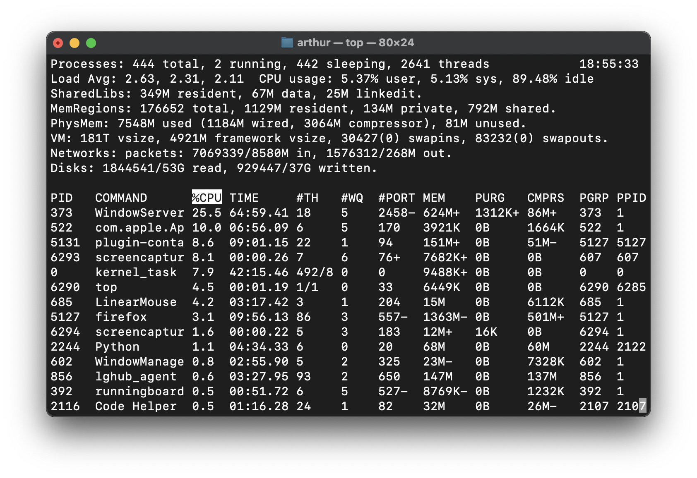
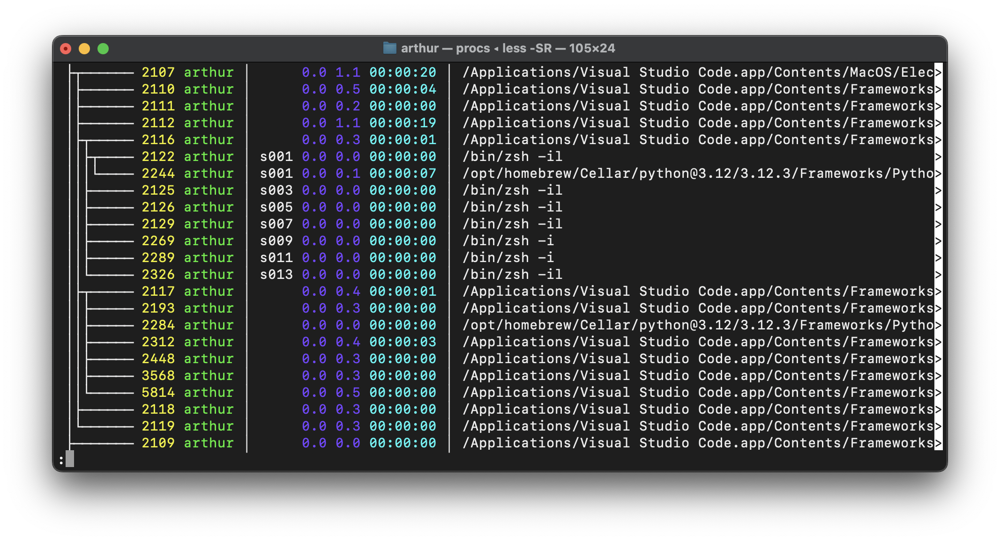
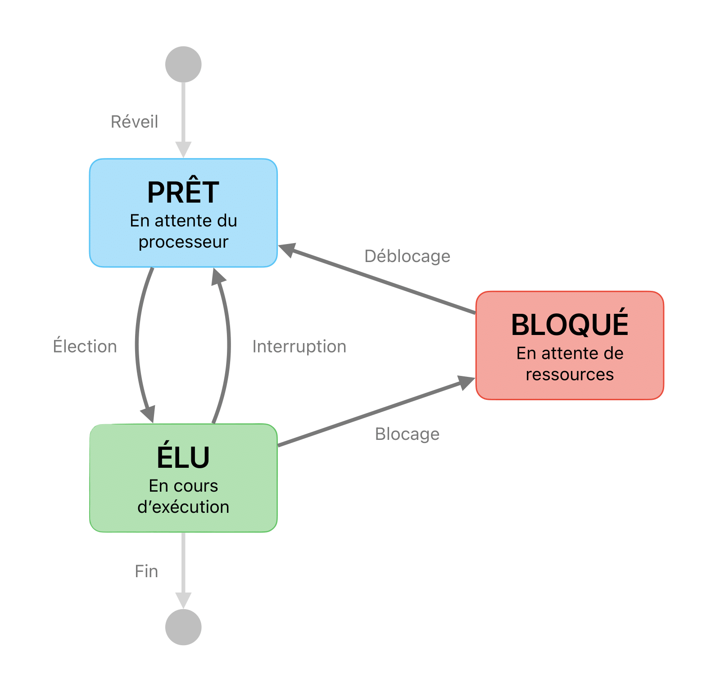
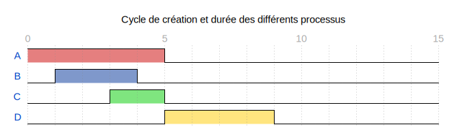

# Processus

* Création d'un processus
* Ordonnancement de plusieurs processus
* Risque de l'interblocage (deadlock)

??? note "Rappels de 1ère"

    Un programme, ou exécutable, est une suite d'instructions en langage machine, c'est-à-dire une suite d’octets que le processeur est capable de décoder et exécuter. Pour des facilités de lecture, on le traduit en langage assembleur, par exemple :

    <div class="grid cards" markdown>

    ```asm title="Code machine"
    00011010
    00100010 
    00010011
    00000011
    01111000 
    ```

    ```asm title="Code assembleur"
    LD A, (DE) 
    LD (HL+), A 
    INC DE 
    DEC BC 
    LD A, B 
    ```

    </div>

    Lorsque ce programme est exécuté, l'OS le charge dans la RAM à une certaine adresse et inscrit cette adresse dans le registre IP (Instruction Pointer) du processeur. Le processeur continue alors sa routine :

    * **Récupérer** l'instruction à exécuter en mémoire
    * **Décoder** l'instruction (déterminer dans la suite d'octets l'instruction à effectuer)
    * **Exécuter** l'instruction

    Ce cycle se répète jusqu'à l'arrêt de la machine.

## Définition

Lorsqu'un programme (fichier `.exe` sur Windows) est exécuté sur un ordinateur, un (parfois plusieurs) __processus__ est crée. Un processus comprend notamment :

* les __instructions__ à exécuter, c'est-à-dire le programme en lui-même ;
* un espace __mémoire__ reservé ;
* des permissions d'accès à des  __ressources__ extérieures (par exemple, un fichier en ouverture).

Un processus est donc une instance d'exécution de ce programme. 

## Rôle du système d'exploitation

Un système d'exploitation (Windows, Linux, MacOS etc.) capable de gérer l'exécution de __plusieurs processus__ est dit __multitâches__. Sur les OS basés sur UNIX, la commande `top` (ou `ps`) permet de surveiller en temps réel l'ensemble des processus en cours d'exécution sur la machine :

<figure markdown="span">
{ width="100%" .center }
</figure>

Sur Windows, le gestionnaire de tâches (accessible par le raccourci ++ctrl+alt+delete++) réalise le même rôle.

## Création d'un processus

Un processus peut être crée :

* Au démarrage du système
* Par un appel d'un autre processus
* Par l'utilisateur

Lors de sa création, le système d'exploitation attribue au processus un identifiant unique, appelé __PID__ (Process Identifier).  Si un processus __parent__ crée un processus __fils__, l'OS attribue au processus fils, en plus de son PID, l'identifiant de son parent, appelé __PPID__ (Parent Process Identifier).

??? info "Pourquoi le PPID ?"
    Le PPID permet de __hiérarchiser__ les processus sous la forme d'un __arbre de processus__. Ainsi, si un processus parent est terminé, tous ses processus fils seront également terminés, et donc par récursion, toute sa descendance.

    <figure markdown="span">
    { width="100%" .center }
    </figure>

    Certaines commandes permettent de visualiser facilement cet arbre. Ici, on peut voir une partie des processus exécutés lorsque que j'utilise mon IDE préféré VSCode.

## Les **3** états d'un processus

On rappelle qu'un processeur ne peut traiter qu'une seule instruction à la fois. Autrement dit, on ne peux exécuter qu'un seul processus à la fois. Pour donner l'illusion de simultanéité d'exécution, **les processus se partagent le processeur à tour de rôle**. Ainsi un processus est soit dans l'état **prêt**, soit dans l'état **élu** :

<figure markdown="span">
{ width="50%" .center }
</figure>

Les processus doivent aussi se partager des ressources extérieures comme la mémoire, le clavier, les fichiers, l'imprimante etc. Lorsqu'un processus a besoin d'une de ces ressources et qu'elle n'est pas disponible, en attendant qu'elle le soit, il libère le processeur et passe en état **bloqué**.

??? question "Question"
    
    Soit le programme Python suivant :
    
    ```py
    age = input('Votre âge ?')
    age += 1
    print(f'Bon anniversaire ! Vous avez {age} ans !')
    sleep(1)
    print('Vous êtes maintenant un peu plus vieux !')
    fichier = open('codes_nucléaires.txt')
    print(fichier.readlines())
    fichier.close()
    ```

    Lorsqu'on exécute ce programme, un processus est crée, mais à quel moment passe-t-il dans l'état **bloqué** ?

## Les interruptions sytèmes


Si un programme est en cours d'exécution sur un processeur, ce dernier exécutera bêtement chaque instruction jusqu'à la dernière. Alors, comment le système d'exploitation parvient-il à reprendre la main ?

Grâce à un mécanisme appellée **interruption** (ou signal) ! Le processeur suspend temporairement le programme en cours lorsqu'une interruption se produit, permettant au système d'exploitation d'intervenir. Une fois terminé, le programme reprend là où il s'était arrêté.

Une interruption peut être déclenchée par différentes actions, comme une touche pressée sur le clavier, une écriture terminée sur le disque dur, ou la réception d'un paquet par la carte réseau. Parmi elles, il y a les interruptions d'horloge, qui se produisent à intervalles réguliers (environ toutes les 100 ns aujourd'hui) et permettent l'exécution de programmes de manière concurrente.

## Le véritable chef d'orchestre : l'ordonnanceur

Bien, nous avons plusieurs processus en attente d'exécution. Comment l'OS détermine le prochain processus à élire ? Et combien de temps d'exécution lui allouer ? C'est le rôle de l'**ordonnanceur** de répondre à ces problématiques.

Que faut-il faire ?

* Traiter le processus le plus prioritaire ?
* ou le plus rapide d'abord ?
* ou dans l'ordre où ils ont été crées ?
* ou à tour de rôle chacun pendant un temps fixe ?

### Exemple

Supposons qu'un processeur doive traiter quatre processus nommés A, B, C et D, chacun ayant des temps d'exécution différents et se présentant à différents instants au processeur :

<div class="center-table" markdown>

| Processus | Cycle de création | Durée en cycles |
| :-------: | :---------------: | :-------------: |
|     A     |         0         |        5        |
|     B     |         1         |        3        |
|     C     |         3         |        2        |
|     D     |         5         |        4        |

</div>

<figure markdown="span">

</figure>

Étant donné que le processeur ne peut traiter qu'un processus à la fois, il est nécessaire de les ordonner de manière à éviter les chevauchements. Voici quelques stratégie d'ordonnancement :

!!! example ""

    <figure markdown="span">
    
    </figure>

    Cette méthode repose sur le principe _« Premier Arrivé, Premier Servi »_ ou FIFO. C'est un ordonnanceur **non-préemtif** car un processus est exécuté de bout en bout.

    ---

    <figure markdown="span">
    
    </figure>

    La méthode _Short Job First_ (SJF) consiste à choisir le processus en attente qui sera le plus rapide à terminer. Elle est non-préemtive.

    ---

    <figure markdown="span">
    
    </figure>

    La méthode _Shortest Remaining Time_ (SRT) est une version préemptive de l’algorithme _Shortest Job First_ (SJF). Lorsqu’un nouveau processus arrive dans la file d’attente, l'ordonnanceur compare sa durée d'exécution estimé avec celui du processus actuellement en cours d'exécution. Si le temps restant du nouveau processus est plus court, ce dernier prend immédiatement la place du processus en cours. C'est un ordonnanceur préemptif car un processus peut être interrompu pour permettre l'exécution d'un autre processus.

    ---

    La méthode __Round Robin__ (RR), ou algorithme du tourniquet, sera en exercice.


Pour comparer ces algorithmes, on peut mesurer :

* La moyenne du __temps de séjour__ pour chaque processus. Le temps de séjour est le délai entre le temps d'arrivée et le temps de terminaison d'un processus.

* La moyenne du __temps d'attente__ pour chaque processus. Le temps d'attente est la différence entre le temps de séjour et la durée totale du processus.

Par exemple, pour la méthode SRT :

<figure markdown="span">

</figure>

<div class="center-table" markdown>

| Processus | Temps de séjour | Temps d'attente |
| :-------: | :-------------: | :-------------: |
|     A     |  $10 - 0 = 10$  |  $10 - 5 = 5$   |
|     B     |   $4 - 1 = 3$   |   $3 - 3 = 0$   |
|     C     |   $6 - 3 = 3$   |   $3 - 2 = 1$   |
|     D     |  $14 - 5 = 9$   |   $9 - 4 = 5$   |

</div>

Ainsi le temps de séjour moyen est de $6.25$ et le temps d'attente moyen de $2.75$.

??? question "Question"

    Faites-en de même pour les méthodes PAPS et SJF. Dresser ensuite un tableau pour comparer ces méthodes.


## Interblocage

Comme nous venons de le voir, un processus peut être dans l'état **bloqué** dans l'attente de la libération d'une ressource.

Ces ressources (l'accès en écriture à un fichier...) ne peuvent être données à deux processus à la fois. Des processus souhaitant accéder à cette ressource sont donc en **concurrence** sur cette ressource. Un processus peut donc devoir attendre qu'une ressource se libère avant de pouvoir y accéder (et ainsi passer de l'état bloqué à l'état prêt). Mais une situation gênante peut appparaître :

<figure markdown="span">

</div>