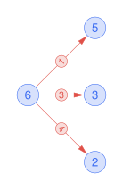
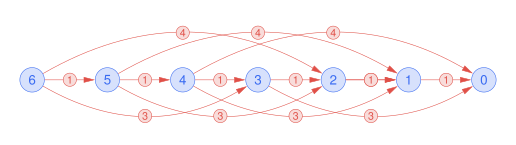
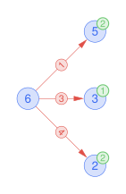
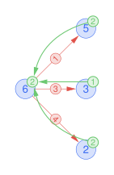
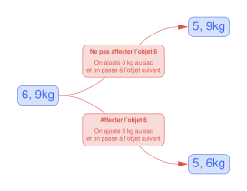
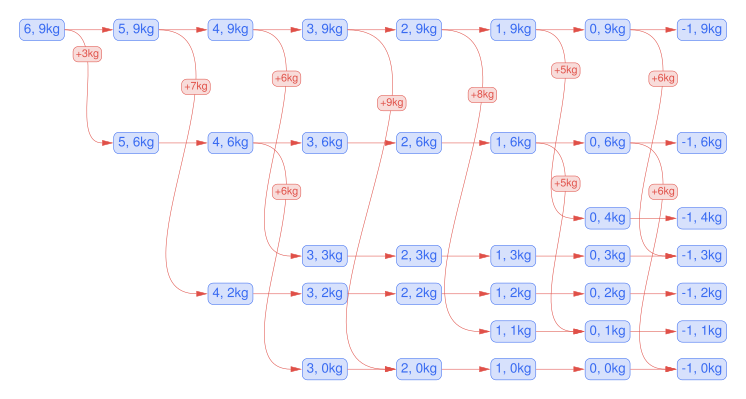

# Programmation Dynamique

## Introduction

La **programmation dynamique** est une stratégie algorithmique de résolution optimale d'un problème d'optimisation. Cette stratégie repose sur deux grands principes :

* **:fontawesome-solid-sitemap: Décomposition** : Le problème est décomposé en sous-problèmes plus petits par une définition récursive.

* **:fontawesome-solid-box-archive: Mémoïsation** : Lorsqu'un sous-problème est résolu, afin d'éviter de le rerésoudre si celui-ci se présente à nouveau ultérieurement, le coût de sa solution est conservé.

## Illustration du principe de mémoïsation

Exemple classique avec Fibonacci.

## La démarche générale

Résoudre un problème d'optimisation implique généralement de prendre une suite de décisions de même nature. Une étape de décision se caractérise plus précisément par :

* Son **état** qui correspond à l'ensemble des informations qui décrivent complètement la situation au moment de prendre la décision.

* L'ensemble des **choix** possibles à partir de cet état. Chaque choix mène vers un autre état.

On pourra alors représenter l'espace des états comme un graphe orienté où les sommets sont des états et les arcs correspondent à des choix.

Il suffit ensuite d'exprimer le coût optimal que l'on peut obtenir depuis un état particulier de manière récursive, c'est-à-dire en fonction des coûts optimaux de ses états enfants. C'est ainsi que l'on définit la **fonction d'état**. Cette démarche ressemble à l'étape « Combiner » dans la stratégie « Diviser pour régner » : on suppose avoir résolu les sous-problèmes d'un problème parent et on cherche maintenant à résoudre ce problème parent.

<!-- > Une fois la fonction d'état définie, il est possible de l'implémenter directement en Python sous la forme d'une fonction récursive. Or, on risque de calculer cette fonction plusieurs fois pour le même état. On conserve alors le coût optimal pour chaque état dans un cache, c'est le principe de mémoïsation. -->

## Un premier exemple introductif

Afin de mettre en lumière les différentes étapes à suivre pour appliquer cette stratégie à un problème quelconque, étudions le problème du rendu de monnaie.

!!! note "Problème du rendu de monnaie"
    Vous devez rendre une somme $S$ d'argent à un vendeur. Pour cela, vous disposez d'une quantité illimitée de pièces de différentes valeurs $V = \left\{ v_1,~ v_2,~ \ldots~ ,~ v_n \right\}$. Votre objectif est de rembourser cette somme en utilisant le moins de pièces possible.


1. Définir les **données** fixes du problème. Ce sont les paramètres qui définissent entièrement une instance du problème.

    > * Somme $S \in \mathbb{N}$ à rendre.
    > * Les différentes valeurs des pièces $V = \left\{ v_1,~ v_2,~ \ldots~ ,~ v_n \right\}$.
    >
    > Par exemple, on peut définir l'instance $S = 6$ et $V = \{1, 3, 4 \}$.

2. Identifier l'**objectif** du problème.

    > On souhaite minimiser le nombre de pièces rendus.
    >
    > Par exemple, pour l'instance $S = 6$ et $V = \{1, 3, 4 \}$, le nombre minimum de pièces à rendre est 2.

3. Identifier la série de décisions à effectuer.
   
    > Ici, à chaque étape, on choisit une pièce d'une valeur particulière à rendre.

4. Définir les variables qui caractérisent totalement l'**état** d'une étape de décision. Finalement, que modifie un choix lors de la prochaine étape de décision ?
   
    > Lorsque qu'on choisit une pièce de valeur $v$ et la rend, la somme à rendre est retranchée de $v$. Donc l'état d'une étape est caractérisé par une seule variable, à savoir la somme restante $s$ à rendre.

5. Définir précisément l'ensemble des **choix** possibles à partir d'un état particulier.
    
    > Soit une somme restante $s$ à rendre, l'ensemble des choix possibles est $\big\{ v \in V ~\big|~v \leq s \big\}$.
    > Choisir une pièce de valeur $v$ de cet ensemble mène vers l'état $s - v$.
    >
    > Par exemple, pour l'instance $S = 6$ et $V = \{1, 3, 4 \}$ :
    >
    > * Les choix possibles et les états accessibles depuis l'état 6 :
    >     { .center }
    >     Les sommets bleus correspondent à des états et les arcs rouges à des choix.
    > * L'espace des états complet :
    > { .center }

6. Définir la **fonction d'état** de manière récursive sans oublier de définir les cas de base. 
   
    > On définit $z(s)$ comme le nombre minimum de pièces à rendre pour rembourser la somme restante $s$.
    >
    > $$z(s) = \begin{cases} 0 & \text{si } s = 0 \\ 1 + \min \Big\{ z(s - v) ~\Big|~ v \in \big\{ v \in V ~\big|~v \leq s \big\} \Big\} & \text{sinon} \end{cases}$$
    > 
    > Résoudre le problème initial revient à calculer $z(S)$.

    > Par exemple, pour l'instance $S = 6$ et $V = \{1, 3, 4 \}$. Supposons qu'on ait les coûts optimaux (en vert sur le schéma) pour les états enfants de l'état 6, à savoir les états 5, 3 et 2. Il faut rendre 2 pièces pour rendre 5 et 3 et 1 pièce pour rendre 3.
    > <center>
      
    </center>
    > Quel est le nombre minimum de pièces pour rendre 6 ? Le minimum de $\{ 2, 1, 2 \}$ plus une pièce ! 

7. Implémenter finalement la fonction d'état en Python avec mémoïsation.

    > 
    ```py title="Sans mémoïsation"
    def rendu(somme_initiale, pieces):
        def nb_pieces_min(s):
            if s == 0:
                return 0
            else:
                return 1 + min(nb_pieces_min(s - v) for v in pieces if v <= s)

        return nb_pieces_min(somme_initiale)
    ```
    >
    ```py title="Avec mémoïsation (dictionnaire)"
    def rendu(somme_initiale, pieces):
        cache = {0: 0}  # les cas de base sont directement inclus dans le cache
        def nb_pieces_min(s):
            if s not in cache:
                cache[s] = 1 + min(nb_pieces_min(s - v) for v in pieces if v <= s)
            return cache[s]

        return nb_pieces_min(somme_initiale)
    ```
    >
    ```py title="Avec mémoïsation (tableau)"
    def rendu(somme_initiale, pieces):
        cache = [0] + [None] * somme_initiale  
        def nb_pieces_min(s):
            if cache[s] is None:
                cache[s] = 1 + min(nb_pieces_min(s - v) for v in pieces if v <= s)
            return cache[v]

        return nb_pieces_min(somme_initiale)
    ```
    > L'approche *bottom-up* consiste à commencer par les cas de base et de remonter progressivement vers le problème initial. Dans le graphe qui représente l'espace des états, cela signifie commencer par les feuilles (les états les plus simples) et remonter jusqu'à la racine (le problème initial). Cette approche revient à observer comment le cache se remplit progressivement, ce qui nous amène à transformer la récursion en une version itérative, souvent plus performante. L'approche récursive est une approche dite *top-down*, puisqu'on part de la racine pour descendre vers les feuilles.
    >
    ```py title="Version itérative - Approche bottom-up"
    def rendu(somme_initiale, pieces):
        cache = [0] + [None] * somme
        for s in range(1, somme + 1):
            cache[s] = 1 + min(cache[s - v] for v in pieces if v <= s)
        return cache[somme]
    ```


## Un second exemple

Problème du sac-à-dos.


* Données :

    > * Un ensemble de $n$ objets. Chaque objet $i$ est caractérisé par un poids $p_i$ et une valeur $v_i$.
    > * La capacité maximale du sac $C$.
    >
    > Par exemple, on peut définir l'instance suivante :
    >
    > $$
    \begin{array}{c*{7}{p{2cm}}}
        \hline
        i & 0 & 1 & 2 & 3 & 4 & 5 & 6 \\
        \hline
        p_i & 6 & 5 & 8 & 9 & 6 & 7 & 3 \\
        \hline
        v_i & 2 & 3 & 6 & 7 & 5 & 9 & 4 \\
        \hline
    \end{array}
    $$
    >
    > Avec $C = 9$.


* Objectif :

    > L'objectif est de déterminer une affectation des objets au sac qui maximise la valeur totale du sac.

* Série de décisions :

    > À chaque étape, on choisit un objet à affecter au sac.

* État :

    > À chaque étape de décision, il est essentiel de connaître quels objets sont encore à considérer et quelle est la capacité restante du sac. On définit un état $(i, c)$ où les objets $i + 1$ à $n - 1$ ont déjà été considérés — on considère donc actuellement l'objet $i$ — et le sac dispose d'une capacité restante de $c$.

* Choix :

    > À partir de l'état $(i, c)$, on peut soit affecter l'objet $i$ au sac s'il rentre dans le sac (c'est-à-dire si $p_i \leq c$), soit ne pas l'affecter. Si $i < 0$ alors on a considéré l'ensemble des objets.
    >
    > En considérant l'exemple :
    >
    > * Les choix possibles et les états accessibles depuis l'état initial $(6, 9)$ :
    > { width=70% .center }
    >
    > * L'espace des états complet :
    > { .center }

* Fonction d'état :
  
    > Soit $z(i, c)$ le profit maximal réalisable en considérant les objets 0 à $i$ :
    >
    >
    $$
    z(i, c) = \begin{cases}
    0 & \text{si } i < 0 \\
    z(i - 1, c) & \text{si } p_i > c \\
    \max \big\{ z(i - 1, c),~ v_i + z(i - 1, c - p_i) \big\} & \text{sinon}
    \end{cases}
    $$
    >
    > Résoudre le problème initial revient à calculer $z(n - 1, C)$.


<!-- > Un problème d'optimisation vise à minimiser ou maximiser une certaine quantité que l'on appelle **objectif**. La valeur de l'objectif réalisée par une **solution** particulière à un problème d'optimisation — une solution est ici définie comme une suite des décisions prises — est appelée **coût**. Une solution est qualifiée d'**optimale** si aucune autre solution ne présente un coût inférieur (resp. supérieur) dans le cas d'une minimisation (resp. maximisation). -->


<!-- 


La définition récursive du problème se manifeste à travers la **fonction d'état**. Cette fonction récursive exprime le coût optimal d'un état donné en fonction des coûts optimaux des états qui le suivent dans la séquence de décision. -->


<!-- 

## Exemple introductif


 -->

<!-- Soit un problème d'optimisation. La programmation dynamique s'applique de manière générale en suivant les étapes :

1. Définir les **données** fixes.
2. Définir l'**objectif** du problème, c'est-à-dire la quantité que l'on souhaite maximiser ou minimiser.
3. Identifier une succession de **choix** à effectuer.
4. Définir les variables qui définissent totalement l'état lors d'une étape de décision.
5. Écrire la **fonction d'état**. -->


<!-- 

## Fibonacci

La suite de Fibonnaci :

\begin{equation}
f(n) = \begin{cases}
f(n-1) + f(n-2) & \text{si } n \geq 1 \\
n & \text{sinon}
\end{cases}
\end{equation}

=== "Récursif"
    La définition naïve et récursive.
    ```py
    def fibonacci(n):
        if n <= 1:  # cas de base
            return n
        return fibonacci(n - 1) + fibonacci(n - 2)
    ```
    La complexité en temps de cet algorithme est exponentielle, plus précisement $\Theta(\varphi^n)$ où $\varphi \approx 1.6180$ est le nombre d'or. L'arbre des appels de la fonction :

    {: style='width: 100%'}

    On remarque des calculs redondants, par exemple $f(3)$ est calculé 2 fois lors de l'appel $f(5)$.


=== "Récursif & Cache"
    On cache les différents termes de la suite de Fibonacci pour éviter des calculs redondants, c'est le principe de **mémoïsation**.
    ```py
    def fibonacci_dp(n):
        def fibonacci_cache(n):
            if cache[n] is None:  # si le n-ième terme n'a pas été calculé
                cache[n] = fibonacci_cache(n - 1) + fibonacci_cache(n - 2)
            return cache[n]

        cache = [0, 1] + [None] * (n - 1)  # les deux premiers termes inclus
        return fibonacci_cache(n)
    ```
=== "Itératif & Cache"
    Une approche *ascendante* (bottom-up) permet de remplir le cache de manière itérative.
    ```py
    def fibonacci_dp_ascendant(n):
        cache = [0, 1] + [None] * (n - 1)
        for i in range(2, n + 1):
            cache[i] = cache[i - 1] + cache[i - 2]
        return cache[n]
    ```
=== "Itératif"
    Finalement, il est suffisant de retenir les deux derniers termes.
    ```py
    def fibonacci_dp_ascendant_optimise(n):
        a, b = 0, 1
        for _ in range(2, n + 1):
            a, b = b, a + b
        return b if n >= 2 else n
    ```
=== "Comparaison"
    Des mesures réelles permettent bien de démontrer que l'ajout d'un cache permet d'obtenir un algorithme de complexité linéaire.

    <figure markdown>
    
    
    </figure>

=== "Formule exacte"
    Il existe une formule exacte de la suite de Fibonacci, la formule de Binet :

    $$
    f(n) = \frac{\varphi^n - \varphi^{\prime n}  }{\sqrt{5}} \quad \text{avec} \quad \varphi = \frac{1 + \sqrt{5}}{2} \quad \text{et} \quad \varphi^\prime = \frac{1 - \sqrt{5}}{2} = - \frac{1}{\varphi}
    $$

    Où $\varphi$ est le fameux nombre d'or. Il serait alors tentant de calculer le $n$-ième terme de la suite de Fibonacci en temps constant :

    ```py
    import math

    def fibonacci_binet(n):
        p1 = (1 + math.sqrt(5)) / 2
        p2 = (1 - math.sqrt(5)) / 2
        résultat = (math.pow(p1, n) - math.pow(p2, n)) / math.sqrt(5)
        return int(résultat)
    ```

    Or, travailler avec des nombres en virgule flottante implique inévitablement des imprécisions de calcul. Par conséquent, à partir de $n = 72$, les termes calculés se révèlent incorrects :
    <center>

    | $n$ |     $f(n)$      |                                                 `fibonacci_binet(n)`                                                 |
    | :-: | :-------------: | :------------------------------------------------------------------------------------------------------------------: |
    | 70  | 190392490709135 |                                                   190392490709135                                                    |
    | 71  | 308061521170129 |                                                   308061521170129                                                    |
    | 72  | 498454011879264 | <span style="background-color: rgba(213, 42, 42, 0.5); padding: 0px 5px; border-radius: 5px;">498454011879265** |
    | 73  | 806515533049393 | <span style="background-color: rgba(213, 42, 42, 0.5); padding: 0px 5px; border-radius: 5px;">806515533049395** |</center>


## Rendu de monnaie

* Données du problème : Une somme initiale à rendre $V$ et un système de pièces $P = (p_1,~ p_2,~ \ldots,~ p_n)$.

* L'état d'un problème : Une somme restante à rendre $v$.

* Choix à partir d'un état : Choisir une pièce $p \in P$.

* Pour une somme $v$ à rendre, on définit $f(v)$ comme le nombre de pièces minimal à rendre. Définition récursive de la fonction d'état $f$ :

    $$
    f(v) = 1 + \min \bigg\{  f(v - p) ~\bigg|~ p \in P \bigg\}
    $$

    * Cas de bases de la fonction d'état :
        * $f(0) = 0$
        * $f(v) = \infty \text{ si } v < 0$

    * Solution au problème initial : $f(V)$

## Sac-à-dos

* Données du problème : Un ensemble d'objets $I$ où objet $i \in I$ est caractérisé par un poids $p_i$ et une valeur $v_i$. Et un sac avec une capacité $C$.

* L'état d'un problème : Une capacité restante $c$. Et un indice $i$ qui indique que l'objet considéré

* Choix à partir d'un état : Ajouter l'objet au sac ou l'ignorer.

* Fonction d'état $f$ :

    $$
    f(c, i) = \max \bigg\{  v_i + f(c - p_i, i - 1), f(c, i - 1) \bigg\}
    $$
 -->
