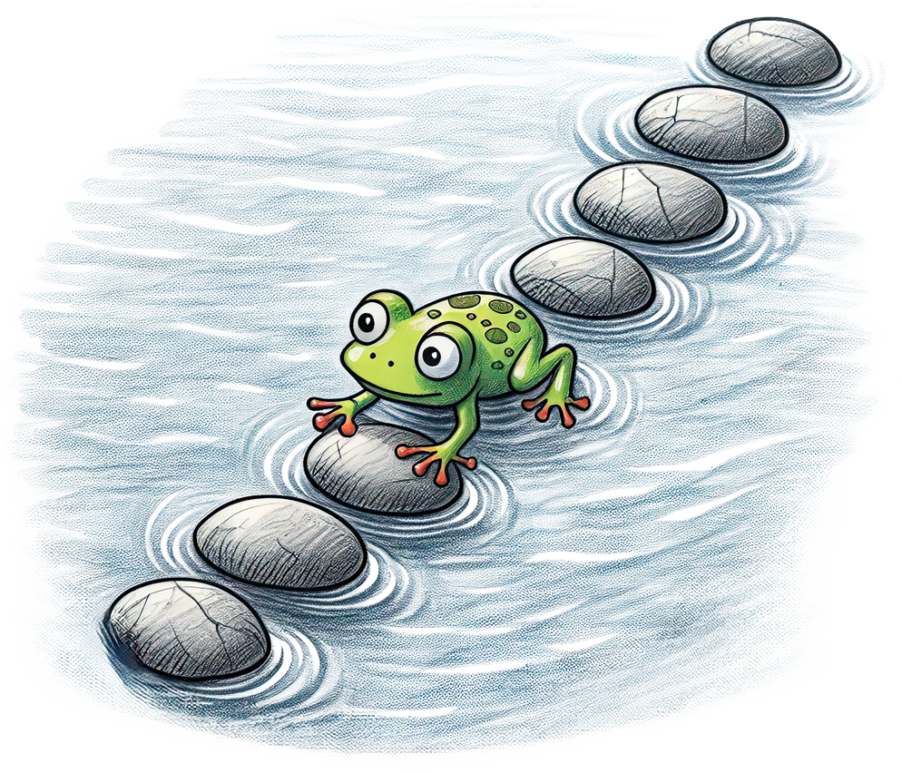
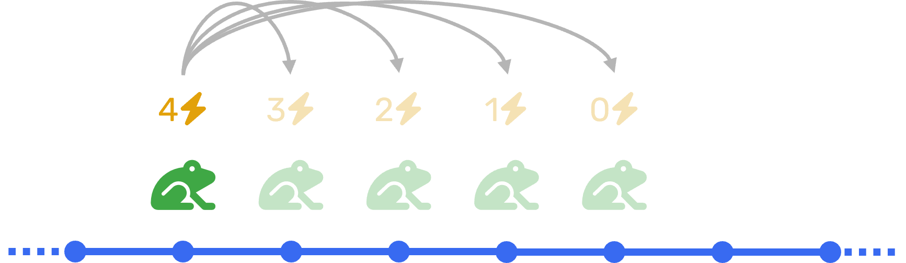

# Problème de la grenouille

## Énoncé

{ width="300px" align=right }

Une **grenouille** désire de traverser un étang dont la surface est ponctuée par $n$ **pierres** uniformément espacées. Les pierres sont  numérotées de $0$ à $n - 1$. Posé initialement sur la première pierre $0$, notre intrépide batracien devra exécuter une séquence de **sauts en avant** afin d'atteindre la dernière pierre $n - 1$.

Si la grenouille saute d'une pierre $i$ vers une pierre $j$ (avec $i < j$ car elle ne peut sauter qu'en avant), elle saute d'une longueur égale à $l = j - i$. La longueur maximale d'un saut de la grenouille dépend de son **niveau d'énergie** (qui ne peut pas descendre en dessous de 0). Un saut de longueur $l$ coûte à la grenouille une quantité d'énergie égale à $l$. Par exemple, avec une énergie initiale de 3, une grenouille posée sur la pierre $0$ peut sauter jusqu'à la pierre $3$ au maximum.

{ width="400px" .center }

Sur certaines pierres, il peut y avoir des **vers**, qui ajoutent de l'énergie à la grenouille. Gourmande, si la grenouille saute sur une pierre avec des vers, elle les mangera tous ! La liste $E = [e_0, e_1, \ldots, e_{n-1}]$ contient les valeurs d'énergie des vers sur les pierres correspondantes. S'il n'y a pas de ver sur la pierre, cela équivaut à une valeur de 0.

La grenouille démarre avec 0 d'énergie, mais il est garanti qu'il y a au moins un ver sur la première pierre.

!!! question Question
    Étant donnée une liste $E$ quelconque, quel est le nombre minimal de sauts  pour que la grenouille atteigne la dernière pierre ? En utilisant la programmation dynamique, élaborer un algorithme et l'implémenter en Python.

## Exemples

## Démarche

1. Définir les **données** du problème.

    > * $n$ le nombre de pierres
    > * La liste $E = [e_0, e_1, \ldots, e_{n-1}]$ des valeurs d'énergie des vers sur les pierres correspondantes 

4. Définir l'**état** qui caractérise complètement l'état de la grenouille.

    > L'état de la grenouille est définit par le couple $(i, e)$ : elle se situe sur la pierre $i$ et a une énergie de $e$.

5. À chaque étape, quels sont les  **choix** possibles ?

    > À chaque étape, la grenouille doit choisir la longueur de son prochain saut. À partir d'un état $(i, e)$ de la grenouille, la longueur de saut maximal qu'elle puisse réaliser est :

    > $$
    l_\max(i, e) = \min(e,~ n - 1 - i)
    $$

    > Son énergie $e$ contraint la longueur du saut et $n - 1 - i$ évite que la grenouille saute plus loin que la dernière pierre.

6. Quel est l'**objectif** du problème ?

    > L'objectif du problème est de déterminer le nombre minimal de sauts pour que la grenouille atteigne la dernière pierre.

7. Définir la **fonction d'état**.

    > On définit $N(i, e)$ comme le nombre minimal de sauts à effectuer pour atteindre la dernière pierre à partir de l'état $(i, e)$ :

    > $$
    N(i, e) =
    \begin{cases}
        0 & \text{si } i = n - 1 \\
        ∞ & \text{si } l_\max(i, e) = 0 \\
        1 + \min \Big\{ N \Big(i + l,~ e - l + e_{i+l} \Big) ~\bigg|~  l \in \Big[\!\!\Big[ 1, l_\max(i, e)  \Big]\!\!\Big] \Big\} & \text{sinon} \\
    \end{cases}
    $$

8. Implémenter la récursion avec et sans cache.
9.  *Optionnel* : Proposer une version itérative qui rempli le cache itérativement.
10. *Optionnel* : Modifier l'algorithme pour donner aussi la séquence de sauts à effectuer.