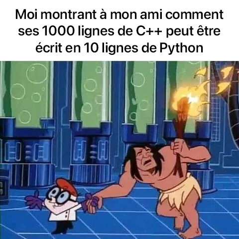

# Accueil



!!! info "Épreuve pratique"
    Les exercices de l'épreuve pratique du bac NSI sont sortis ([disponible en cliquant ici](https://cyclades.education.gouv.fr/delos/public/listPublicECE)) ! Je vous propose de collectivement corriger ces exercices ! 🤝

    Un petit programme pour nous répartir le travail de manière équitable :

    ```py
    from pprint import pprint
    from random import sample
    from itertools import batched

    eleves = ['Ezeykiel', 'Ismaël', 'Louis', 'Lucas',
            'Mallory', 'Nathan', 'Rafaël', 'Thomas']
    nb_sujets = 48
    sujets = sample(range(1, nb_sujets + 1), nb_sujets)
    pprint({e: s for e, s in zip(eleves, batched(sujets, nb_sujets // len(eleves)))})
    ```

    ```
    {'Ezeykiel': (5, 4, 40, 20, 30, 42),
    'Ismaël': (18, 47, 16, 27, 26, 22),
    'Louis': (46, 14, 7, 21, 29, 2),
    'Lucas': (11, 8, 3, 19, 17, 33),
    'Mallory': (12, 39, 1, 45, 34, 36),
    'Nathan': (31, 35, 48, 43, 15, 10),
    'Rafaël': (9, 23, 32, 24, 38, 37),
    'Thomas': (25, 28, 13, 6, 41, 44)}
    ```

    Tout ceci s'est évidemment déroulé sous le contrôle d'un huissier de justice.


!!! success "Travaux en cours"
    * Finir l'algorithme de Dijkstra et le bulletin météo et me l'envoyer !
    * [Les arbres binaires](TNSI/T2 Structures de données/7arbres/)
    * Corriger les exercices de l'épreuve pratique attitrées

<!-- <div class="ascii-art">
>>> flocons = [Flocon() for i in range(3)]
>>> print(flocons)

       .      .                             ..    ..
       _\/  \/_           *  .  *           '\    /'
        _\/\/_          . _\/ \/_ .           \\//
    _\_\_\/\/_/_/_       \  \ /  /       _.__\\\///__._
     / /_/\/\_\ \      -==>: X :<==-      '  ///\\\  '
        _/\/\_           / _/ \_ \            //\\
        /\  /\          '  /\ /\  '         ./    \.
       '      '           *  '  *           ''    ''
</div> -->

<!-- # Accueil

Cours, exercices et autres ressources pour mes élèves de terminale en spécialité NSI au lycée Émile Combes à Pons.

!!! quote "Edsger W. Dijkstra"
    Computer Science is no more about computers than astronomy is about telescopes. -->

## Liens utiles
* [:fontawesome-solid-flag: Programme en vigueur de spécialité NSI de terminale générale](https://eduscol.education.fr/document/30010/download)


* [:fontawesome-solid-graduation-cap:  Annales des épreuves écrites et pratiques au baccalauréat NSI](https://pixees.fr/informatiquelycee/term/)

