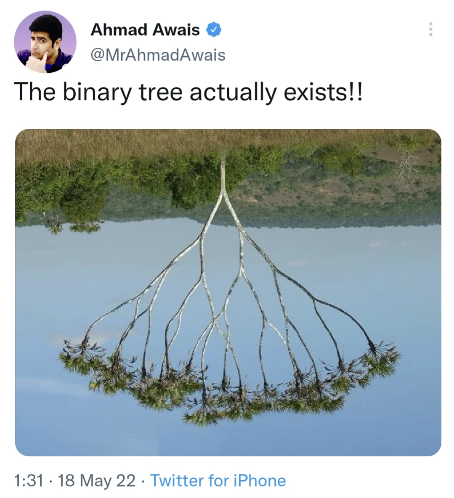

# Accueil

!!! success "Travaux en cours"
    * Finir l'algorithme de Dijkstra et le bulletin météo et me l'envoyer !
    * [Les arbres binaires](/T2 Structures de données/7arbres/)

<!-- 

>>> flocons = [Flocon() for i in range(3)]
>>> print(flocons)

       .      .                             ..    ..
       _\/  \/_           *  .  *           '\    /'
        _\/\/_          . _\/ \/_ .           \\//
    _\_\_\/\/_/_/_       \  \ /  /       _.__\\\///__._
     / /_/\/\_\ \      -==>: X :<==-      '  ///\\\  '
        _/\/\_           / _/ \_ \            //\\
        /\  /\          '  /\ /\  '         ./    \.
       '      '           *  '  *           ''    ''

 -->

<!-- # Accueil

Cours, exercices et autres ressources pour mes élèves de terminale en spécialité NSI au lycée Émile Combes à Pons.

!!! quote "Edsger W. Dijkstra"
    Computer Science is no more about computers than astronomy is about telescopes. -->

## Liens utiles
* [:fontawesome-solid-flag: Programme en vigueur de spécialité NSI de terminale générale](https://eduscol.education.fr/document/30010/download)

* [:fontawesome-solid-graduation-cap:  Annales des épreuves écrites et pratiques au baccalauréat NSI](https://pixees.fr/informatiquelycee/term/)

